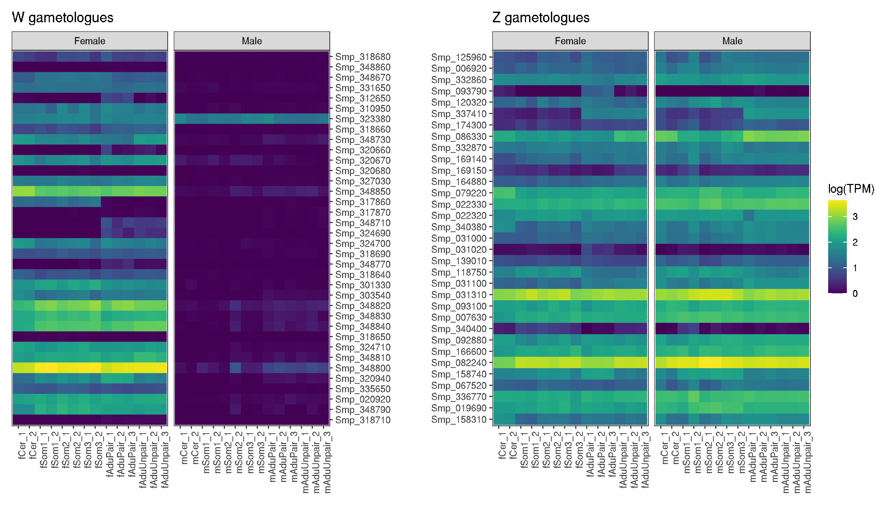

# Schistosoma mansoni V10 genome: RNAseq of Z and W gametologues from male and females

### author: Stephen Doyle, stephen.doyle[at]sanger.ac.uk

## Setup data 
```bash
cd /nfs/users/nfs_s/sd21/lustre118_link/schistosoma_mansoni/V10/RNASEQ

mkdir DATA

# samples from Picard et al
fAdu_1	SRR3223447.fastq.gz
fAdu_2	SRR3223448.fastq.gz
fCer_1	SRR3223434.fastq.gz
fCer_2	SRR3223435.fastq.gz
fSom1_1	SRR3223436.fastq.gz
fSom1_2	SRR3223439.fastq.gz
fSom2_1	SRR3223443.fastq.gz
fSom2_2	SRR3223444.fastq.gz
fSom3_1	SRR3223445.fastq.gz
fSom3_2	SRR3223446.fastq.gz
mAdu_1	SRR3223432.fastq.gz
mAdu_2	SRR3223433.fastq.gz
mCer_1	SRR3211868.fastq.gz
mCer_2	SRR3216389.fastq.gz
mSom1_1	SRR3223426.fastq.gz
mSom1_2	SRR3223427.fastq.gz
mSom2_1	SRR3223428.fastq.gz
mSom2_2	SRR3223429.fastq.gz
mSom3_1	SRR3223430.fastq.gz
mSom3_2	SRR3223431.fastq.gz

# samples from Lu et al
bf_1_9645648	12391_1#6
bf_1_9645648	12391_2#6
bf_1_9645648	13853_1#6
bf_1_9645648	13853_2#6
bf_1_9645648	13854_1#6
bf_1_9645648	13854_2#6
bf_2_9645655	12391_1#14
bf_2_9645655	12391_2#14
bf_2_9645655	13853_1#14
bf_2_9645655	13853_2#14
bf_2_9645655	13854_1#14
bf_2_9645655	13854_2#14
bf_3_9645656	12391_1#15
bf_3_9645656	12391_2#15
bf_3_9645656	13853_1#15
bf_3_9645656	13853_2#15
bf_3_9645656	13854_1#15
bf_3_9645656	13854_2#15
bm_1_9645654	12391_1#12
bm_1_9645654	12391_2#12
bm_1_9645654	13853_1#12
bm_1_9645654	13853_2#12
bm_1_9645654	13854_1#12
bm_1_9645654	13854_2#12
bm_2_9645661	12391_1#19
bm_2_9645661	12391_2#19
bm_2_9645661	13853_1#19
bm_2_9645661	13853_2#19
bm_2_9645661	13854_1#19
bm_2_9645661	13854_2#19
bm_3_9645662	12391_1#21
bm_3_9645662	12391_2#21
bm_3_9645662	13853_1#21
bm_3_9645662	13853_2#21
bm_3_9645662	13854_1#21
bm_3_9645662	13854_2#21
sf_1_9645663	12391_1#22
sf_1_9645663	12391_2#22
sf_1_9645663	13853_1#22
sf_1_9645663	13853_2#22
sf_1_9645663	13854_1#22
sf_1_9645663	13854_2#22
sf_2_9645664	12391_1#23
sf_2_9645664	12391_2#23
sf_2_9645664	13853_1#23
sf_2_9645664	13853_2#23
sf_2_9645664	13854_1#23
sf_2_9645664	13854_2#23
sf_3_9645665	12391_1#24
sf_3_9645665	12391_2#24
sf_3_9645665	13853_1#24
sf_3_9645665	13853_2#24
sf_3_9645665	13854_1#24
sf_3_9645665	13854_2#24
sm_1_9645658	12391_1#17
sm_1_9645658	12391_2#17
sm_1_9645658	13853_1#17
sm_1_9645658	13853_2#17
sm_1_9645658	13854_1#17
sm_1_9645658	13854_2#17
sm_2_9645659	12391_1#18
sm_2_9645659	12391_2#18
sm_2_9645659	13853_1#18
sm_2_9645659	13853_2#18
sm_2_9645659	13854_1#18
sm_2_9645659	13854_2#18
sm_3_9645660	12391_1#20
sm_3_9645660	12391_2#20
sm_3_9645660	13853_1#20
sm_3_9645660	13853_2#20
sm_3_9645660	13854_1#20
sm_3_9645660	13854_2#20

# which have been renamed as:

mAduUnpair_3	12391_1#20_1.fastq.gz,12391_2#20_1.fastq.gz,13853_1#20_1.fastq.gz,13853_2#20_1.fastq.gz,13854_1#20_1.fastq.gz,13854_2#20_1.fastq.gz	12391_1#20_2.fastq.gz,12391_2#20_2.fastq.gz,13853_1#20_2.fastq.gz,13853_2#20_2.fastq.gz,13854_1#20_2.fastq.gz,13854_2#20_2.fastq.gz
mAduUnpair_2	12391_1#18_1.fastq.gz,12391_2#18_1.fastq.gz,13853_1#18_1.fastq.gz,13853_2#18_1.fastq.gz,13854_1#18_1.fastq.gz,13854_2#18_1.fastq.gz	12391_1#18_2.fastq.gz,12391_2#18_2.fastq.gz,13853_1#18_2.fastq.gz,13853_2#18_2.fastq.gz,13854_1#18_2.fastq.gz,13854_2#18_2.fastq.gz
mAduUnpair_1	12391_1#17_1.fastq.gz,12391_2#17_1.fastq.gz,13853_1#17_1.fastq.gz,13853_2#17_1.fastq.gz,13854_1#17_1.fastq.gz,13854_2#17_1.fastq.gz	12391_1#17_2.fastq.gz,12391_2#17_2.fastq.gz,13853_1#17_2.fastq.gz,13853_2#17_2.fastq.gz,13854_1#17_2.fastq.gz,13854_2#17_2.fastq.gz
fAduUnpair_3	12391_2#24_1.fastq.gz,13853_1#24_1.fastq.gz,13853_2#24_1.fastq.gz,13854_1#24_1.fastq.gz,13854_2#24_1.fastq.gz 	12391_2#24_2.fastq.gz,13853_1#24_2.fastq.gz,13853_2#24_2.fastq.gz,13854_1#24_2.fastq.gz,13854_2#24_2.fastq.gz
fAduUnpair_2	12391_1#23_1.fastq.gz,12391_2#23_1.fastq.gz,13853_1#23_1.fastq.gz,13853_2#23_1.fastq.gz,13854_1#23_1.fastq.gz,13854_2#23_1.fastq.gz	12391_1#23_2.fastq.gz,12391_2#23_2.fastq.gz,13853_1#23_2.fastq.gz,13853_2#23_2.fastq.gz,13854_1#23_2.fastq.gz,13854_2#23_2.fastq.gz
fAduUnpair_1	12391_1#22_1.fastq.gz,12391_2#22_1.fastq.gz,13853_1#22_1.fastq.gz,13853_2#22_1.fastq.gz,13854_1#22_1.fastq.gz,13854_2#22_1.fastq.gz	12391_1#22_2.fastq.gz,12391_2#22_2.fastq.gz,13853_1#22_2.fastq.gz,13853_2#22_2.fastq.gz,13854_1#22_2.fastq.gz,13854_2#22_2.fastq.gz
mAduPair_3	12391_1#21_1.fastq.gz,12391_2#21_1.fastq.gz,13853_1#21_1.fastq.gz,13853_2#21_1.fastq.gz,13854_1#21_1.fastq.gz,13854_2#21_1.fastq.gz	12391_1#21_2.fastq.gz,12391_2#21_2.fastq.gz,13853_1#21_2.fastq.gz,13853_2#21_2.fastq.gz,13854_1#21_2.fastq.gz,13854_2#21_2.fastq.gz
mAduPair_2	12391_1#19_1.fastq.gz,12391_2#19_1.fastq.gz,13853_1#19_1.fastq.gz,13853_2#19_1.fastq.gz,13854_1#19_1.fastq.gz,13854_2#19_1.fastq.gz	12391_1#19_2.fastq.gz,12391_2#19_2.fastq.gz,13853_1#19_2.fastq.gz,13853_2#19_2.fastq.gz,13854_1#19_2.fastq.gz,13854_2#19_2.fastq.gz
mAduPair_1	12391_1#6_1.fastq.gz,12391_2#6_1.fastq.gz,13853_1#6_1.fastq.gz,13853_2#6_1.fastq.gz,13854_1#6_1.fastq.gz,13854_2#6_1.fastq.gz	12391_1#6_2.fastq.gz,12391_2#6_2.fastq.gz,13853_1#6_2.fastq.gz,13853_2#6_2.fastq.gz,13854_1#6_2.fastq.gz,13854_2#6_2.fastq.gz
fAduPair_3	12391_1#15_1.fastq.gz,12391_2#15_1.fastq.gz,13853_1#15_1.fastq.gz,13853_2#15_1.fastq.gz,13854_1#15_1.fastq.gz,13854_2#15_1.fastq.gz	12391_1#15_2.fastq.gz,12391_2#15_2.fastq.gz,13853_1#15_2.fastq.gz,13853_2#15_2.fastq.gz,13854_1#15_2.fastq.gz,13854_2#15_2.fastq.gz
fAduPair_2	12391_1#14_1.fastq.gz,12391_2#14_1.fastq.gz,13853_1#14_1.fastq.gz,13853_2#14_1.fastq.gz,13854_1#14_1.fastq.gz,13854_2#14_1.fastq.gz	12391_1#14_2.fastq.gz,12391_2#14_2.fastq.gz,13853_1#14_2.fastq.gz,13853_2#14_2.fastq.gz,13854_1#14_2.fastq.gz,13854_2#14_2.fastq.gz
fAduPair_1	12391_1#12_1.fastq.gz,12391_2#12_1.fastq.gz,13853_1#12_1.fastq.gz,13853_2#12_1.fastq.gz,13854_1#12_1.fastq.gz,13854_2#12_1.fastq.gz	12391_1#12_2.fastq.gz,12391_2#12_2.fastq.gz,13853_1#12_2.fastq.gz,13853_2#12_2.fastq.gz,13854_1#12_2.fastq.gz,13854_2#12_2.fastq.gz

```


## and reference files for mapping
```bash
mkdir STAR_GENOME

# make a gtf
gffread /nfs/users/nfs_s/sd21/lustre118_link/schistosoma_mansoni/V10/REF/SM_V10.annotation.preWBP18checked.gff3 -T -o SM_V10.annotation.reWBP18checked.gtf

# Optimisation of STAR parameters: https://link.springer.com/protocol/10.1007/978-1-4939-3572-7_13

bsub.py --threads 8 20 starmap_genome "/nfs/users/nfs_s/sd21/lustre118_link/software/TRANSCRIPTOME/STAR-2.7.10b/bin/Linux_x86_64_static/STAR \
     --runMode genomeGenerate \
     --runThreadN 8 \
     --genomeDir STAR_GENOME \
     --genomeFastaFiles /nfs/users/nfs_s/sd21/lustre118_link/schistosoma_mansoni/V10/REF/SM_V10.genome.preWBP18checked.fa \
     --sjdbGTFfile /nfs/users/nfs_s/sd21/lustre118_link/schistosoma_mansoni/V10/RNASEQ/SM_V10.annotation.reWBP18checked.gtf \
     --limitGenomeGenerateRAM 90000000000 \
     --genomeSAindexNbases 13"

```

## Mapping single end reads
```bash
# map single end reads
>run_star_mapping_SE.sh

while read SAMPLE_NAME FASTQ ; do
     echo "bsub.py --threads 4 20 starmap_${SAMPLE_NAME} \"/nfs/users/nfs_s/sd21/lustre118_link/software/TRANSCRIPTOME/STAR-2.7.10b/bin/Linux_x86_64_static/STAR \\
     --runThreadN 4 \\
     --genomeDir ../STAR_GENOME \\
     --readFilesIn ${FASTQ} \\
     --readFilesCommand zcat \\
     --alignIntronMin 10 \\
     --outSAMtype BAM SortedByCoordinate \\
     --twopassMode Basic \\
     --outFileNamePrefix star_${SAMPLE_NAME} \\
     --outTmpDir star_tmp_${SAMPLE_NAME} \"" >> run_star_mapping_SE.sh; 
done < SE_samplename_fastqs.list

chmod a+x run_star_mapping_SE.sh

./run_star_mapping_SE.sh

```
where "SE_samplename_fastqs.list" contains:

```bash 
fAdu_1	SRR3223447.fastq.gz
fAdu_2	SRR3223448.fastq.gz
fCer_1	SRR3223434.fastq.gz
fCer_2	SRR3223435.fastq.gz
fSom1_1	SRR3223436.fastq.gz
fSom1_2	SRR3223439.fastq.gz
fSom2_1	SRR3223443.fastq.gz
fSom2_2	SRR3223444.fastq.gz
fSom3_1	SRR3223445.fastq.gz
fSom3_2	SRR3223446.fastq.gz
mAdu_1	SRR3223432.fastq.gz
mAdu_2	SRR3223433.fastq.gz
mCer_1	SRR3211868.fastq.gz
mCer_2	SRR3216389.fastq.gz
mSom1_1	SRR3223426.fastq.gz
mSom1_2	SRR3223427.fastq.gz
mSom2_1	SRR3223428.fastq.gz
mSom2_2	SRR3223429.fastq.gz
mSom3_1	SRR3223430.fastq.gz
mSom3_2	SRR3223431.fastq.gz

```


## Map paired end reads
```bash
# need to be in the DATA dir due to the concatenated fastq files
cd ~/lustre118_link/schistosoma_mansoni/V10/RNASEQ/DATA

>run_star_mapping_PE.sh
while read SAMPLE_NAME FASTQ1 FASTQ2 ; do
     echo "bsub.py --threads 4 20 starmap_${SAMPLE_NAME} \"/nfs/users/nfs_s/sd21/lustre118_link/software/TRANSCRIPTOME/STAR-2.7.10b/bin/Linux_x86_64_static/STAR \\
          --runThreadN 4 \\
          --genomeDir ../STAR_GENOME \\
          --readFilesIn ${FASTQ1} ${FASTQ2} \\
          --readFilesCommand zcat \\
          --alignIntronMin 10 \\
          --alignIntronMax 100000 \\
          --outSAMtype BAM SortedByCoordinate \\
          --twopassMode Basic \\
          --outFileNamePrefix star_${SAMPLE_NAME} \\
          --outWigType bedGraph \\
          --outTmpDir star_tmp_${SAMPLE_NAME} \"" >> run_star_mapping_PE.sh; 
done < PE_samplename_fastqs.list

chmod a+x run_star_mapping_PE.sh

./run_star_mapping_PE.sh

```
where "PE_samplename_fastqs.list" cotains:

```bash 
mAduUnpair_3	12391_1#20_1.fastq.gz,12391_2#20_1.fastq.gz,13853_1#20_1.fastq.gz,13853_2#20_1.fastq.gz,13854_1#20_1.fastq.gz,13854_2#20_1.fastq.gz	12391_1#20_2.fastq.gz,12391_2#20_2.fastq.gz,13853_1#20_2.fastq.gz,13853_2#20_2.fastq.gz,13854_1#20_2.fastq.gz,13854_2#20_2.fastq.gz
mAduUnpair_2	12391_1#18_1.fastq.gz,12391_2#18_1.fastq.gz,13853_1#18_1.fastq.gz,13853_2#18_1.fastq.gz,13854_1#18_1.fastq.gz,13854_2#18_1.fastq.gz	12391_1#18_2.fastq.gz,12391_2#18_2.fastq.gz,13853_1#18_2.fastq.gz,13853_2#18_2.fastq.gz,13854_1#18_2.fastq.gz,13854_2#18_2.fastq.gz
mAduUnpair_1	12391_1#17_1.fastq.gz,12391_2#17_1.fastq.gz,13853_1#17_1.fastq.gz,13853_2#17_1.fastq.gz,13854_1#17_1.fastq.gz,13854_2#17_1.fastq.gz	12391_1#17_2.fastq.gz,12391_2#17_2.fastq.gz,13853_1#17_2.fastq.gz,13853_2#17_2.fastq.gz,13854_1#17_2.fastq.gz,13854_2#17_2.fastq.gz
fAduUnpair_3	12391_2#24_1.fastq.gz,13853_1#24_1.fastq.gz,13853_2#24_1.fastq.gz,13854_1#24_1.fastq.gz,13854_2#24_1.fastq.gz 	12391_2#24_2.fastq.gz,13853_1#24_2.fastq.gz,13853_2#24_2.fastq.gz,13854_1#24_2.fastq.gz,13854_2#24_2.fastq.gz
fAduUnpair_2	12391_1#23_1.fastq.gz,12391_2#23_1.fastq.gz,13853_1#23_1.fastq.gz,13853_2#23_1.fastq.gz,13854_1#23_1.fastq.gz,13854_2#23_1.fastq.gz	12391_1#23_2.fastq.gz,12391_2#23_2.fastq.gz,13853_1#23_2.fastq.gz,13853_2#23_2.fastq.gz,13854_1#23_2.fastq.gz,13854_2#23_2.fastq.gz
fAduUnpair_1	12391_1#22_1.fastq.gz,12391_2#22_1.fastq.gz,13853_1#22_1.fastq.gz,13853_2#22_1.fastq.gz,13854_1#22_1.fastq.gz,13854_2#22_1.fastq.gz	12391_1#22_2.fastq.gz,12391_2#22_2.fastq.gz,13853_1#22_2.fastq.gz,13853_2#22_2.fastq.gz,13854_1#22_2.fastq.gz,13854_2#22_2.fastq.gz
mAduPair_3	12391_1#21_1.fastq.gz,12391_2#21_1.fastq.gz,13853_1#21_1.fastq.gz,13853_2#21_1.fastq.gz,13854_1#21_1.fastq.gz,13854_2#21_1.fastq.gz	12391_1#21_2.fastq.gz,12391_2#21_2.fastq.gz,13853_1#21_2.fastq.gz,13853_2#21_2.fastq.gz,13854_1#21_2.fastq.gz,13854_2#21_2.fastq.gz
mAduPair_2	12391_1#19_1.fastq.gz,12391_2#19_1.fastq.gz,13853_1#19_1.fastq.gz,13853_2#19_1.fastq.gz,13854_1#19_1.fastq.gz,13854_2#19_1.fastq.gz	12391_1#19_2.fastq.gz,12391_2#19_2.fastq.gz,13853_1#19_2.fastq.gz,13853_2#19_2.fastq.gz,13854_1#19_2.fastq.gz,13854_2#19_2.fastq.gz
mAduPair_1	12391_1#6_1.fastq.gz,12391_2#6_1.fastq.gz,13853_1#6_1.fastq.gz,13853_2#6_1.fastq.gz,13854_1#6_1.fastq.gz,13854_2#6_1.fastq.gz	12391_1#6_2.fastq.gz,12391_2#6_2.fastq.gz,13853_1#6_2.fastq.gz,13853_2#6_2.fastq.gz,13854_1#6_2.fastq.gz,13854_2#6_2.fastq.gz
fAduPair_3	12391_1#15_1.fastq.gz,12391_2#15_1.fastq.gz,13853_1#15_1.fastq.gz,13853_2#15_1.fastq.gz,13854_1#15_1.fastq.gz,13854_2#15_1.fastq.gz	12391_1#15_2.fastq.gz,12391_2#15_2.fastq.gz,13853_1#15_2.fastq.gz,13853_2#15_2.fastq.gz,13854_1#15_2.fastq.gz,13854_2#15_2.fastq.gz
fAduPair_2	12391_1#14_1.fastq.gz,12391_2#14_1.fastq.gz,13853_1#14_1.fastq.gz,13853_2#14_1.fastq.gz,13854_1#14_1.fastq.gz,13854_2#14_1.fastq.gz	12391_1#14_2.fastq.gz,12391_2#14_2.fastq.gz,13853_1#14_2.fastq.gz,13853_2#14_2.fastq.gz,13854_1#14_2.fastq.gz,13854_2#14_2.fastq.gz
fAduPair_1	12391_1#12_1.fastq.gz,12391_2#12_1.fastq.gz,13853_1#12_1.fastq.gz,13853_2#12_1.fastq.gz,13854_1#12_1.fastq.gz,13854_2#12_1.fastq.gz	12391_1#12_2.fastq.gz,12391_2#12_2.fastq.gz,13853_1#12_2.fastq.gz,13853_2#12_2.fastq.gz,13854_1#12_2.fastq.gz,13854_2#12_2.fastq.gz

```

- once mapping is complete, clean up

```bash
mkdir /nfs/users/nfs_s/sd21/lustre118_link/schistosoma_mansoni/V10/RNASEQ/STAR_BAMS

mv *bam /nfs/users/nfs_s/sd21/lustre118_link/schistosoma_mansoni/V10/RNASEQ/STAR_BAMS

# extract uniquely mapped reads
for i in *bam; do 
     bsub.py 2 samtools_get_unique "samtools view -b -F 256 -q 255  -o ${i%Aligned.sortedByCoord.out.bam}.unique.bam ${i}"; 
     done 

```


## Fix annotation before running stringtie
```bash
cd /nfs/users/nfs_s/sd21/lustre118_link/schistosoma_mansoni/V10/RNASEQ/STRINGTIE

# removed the 8th exon on Smp_323380 to account for a misassembly artefact on the Z gaemtolog thats causing false expression on the W in male samples
cat /nfs/users/nfs_s/sd21/lustre118_link/schistosoma_mansoni/V10/REF/SM_V10.annotation.preWBP18checked.gff3 | grep -vP "SM_V10_WSR\tWormBase_imported\tCDS\t3511322\t3511408" | grep -vP "SM_V10_WSR\tWormBase_imported\texon\t3511322\t3512557" > SM_V10.WSR_Smp_323380modified.gff3

# fixed the gene ID of Smp_324690 - pseudogenes didnt get renamed properly in the V10 annotation update
sed -i 's/c1512432-49d5-4117-8bc2-82a9e7e91aec/Smp_324690/g' SM_V10.WSR_Smp_323380modified.gff3
sed -i 's/3f41e371-e1ce-441d-ad6e-22d58b6d60fd/Smp_324690.1/g' SM_V10.WSR_Smp_323380modified.gff3

# for Smp_337410, we need to trim the 3' end so that is stops on a splice donor.
sed -i "s/SM_V10_Z\\tWormBase_imported\\tCDS\\t11900195\\t11900458/SM_V10_Z\\tWormBase_imported\\tCDS\\t11900195\\t11900434/" SM_V10.WSR_Smp_323380modified.gff3

sed -i "s/SM_V10_Z\\tWormBase_imported\\texon\\t11900195\\t11900492/SM_V10_Z\\tWormBase_imported\\texon\\t11900195\\t11900434/" SM_V10.WSR_Smp_323380modified.gff3

```


## run stringtie
```bash 
cd /nfs/users/nfs_s/sd21/lustre118_link/schistosoma_mansoni/V10/RNASEQ/STRINGTIE


module load stringtie/2.1.4--h7e0af3c_0

for i in $(cd /nfs/users/nfs_s/sd21/lustre118_link/schistosoma_mansoni/V10/RNASEQ/STAR_BAMS/ ; ls -1 *unique.bam) ; do 
     bsub.py 10 --threads 5 stringtie_${i%.unique.bam} "stringtie \
     /nfs/users/nfs_s/sd21/lustre118_link/schistosoma_mansoni/V10/RNASEQ/STAR_BAMS/${i} \
     -G SM_V10.WSR_Smp_323380modified.gff3 \
     -p 5 -A ${i%.unique.bam}_abund.out";
done

# cleanup the filename 
for file in *_abund.out ; do 
     mv -v "$file" "${file#*star_}"; 
     done

# module load stringtie/2.1.4--h7e0af3c_0
# for i in $(cd /nfs/users/nfs_s/sd21/lustre118_link/schistosoma_mansoni/V10/RNASEQ/STAR_BAMS/ ; ls -1 *unique.bam) ; do 
#      bsub.py 10 --threads 5 stringtie_${i%.unique.bam} "stringtie \
#      /nfs/users/nfs_s/sd21/lustre118_link/schistosoma_mansoni/V10/RNASEQ/STAR_BAMS/${i} \
#      -G /nfs/users/nfs_s/sd21/lustre118_link/schistosoma_mansoni/V10/REF/SM_V10.annotation.preWBP18checked.gff3 \
#      -p 5 -A ${i%.unique.bam}_abund.out";
# done


```


## Rearrange the data for plotting
```bash
> sex.stage.z_genes.data.txt
n=0
while read GENE; do \
     n=$((n + 1)); \
     for STAGE in mCer_1_abund.out \
          mCer_2_abund.out \
          mSom1_1_abund.out \
          mSom1_2_abund.out \
          mSom2_1_abund.out \
          mSom2_2_abund.out \
          mSom3_1_abund.out \
          mSom3_2_abund.out \
          mAduPair_1_abund.out \
          mAduPair_2_abund.out \
          mAduPair_3_abund.out \
          mAduUnpair_1_abund.out \
          mAduUnpair_2_abund.out \
          mAduUnpair_3_abund.out \
          fCer_1_abund.out \
          fCer_2_abund.out \
          fSom1_1_abund.out \
          fSom1_2_abund.out \
          fSom2_1_abund.out \
          fSom2_2_abund.out \
          fSom3_1_abund.out \
          fSom3_2_abund.out \
          fAduPair_1_abund.out \
          fAduPair_2_abund.out \
          fAduPair_3_abund.out \
          fAduUnpair_1_abund.out \
          fAduUnpair_2_abund.out \
          fAduUnpair_3_abund.out; do
               SEX=$(echo ${STAGE} | cut -c1) ;
               grep "${GENE}" ${STAGE} |\
               awk -v COUNT=${n} -v STAGE=${STAGE%_abund.out} -v SEX=${SEX} '{print SEX,STAGE,$1,$9,COUNT}' OFS="\t" \
               >> sex.stage.z_genes.data.txt;
               done ;
          done < z_genes.list

> sex.stage.w_genes.data.txt
n=0
while read GENE; do \
     n=$((n + 1)); \
     for STAGE in mCer_1_abund.out \
          mCer_2_abund.out \
          mSom1_1_abund.out \
          mSom1_2_abund.out \
          mSom2_1_abund.out \
          mSom2_2_abund.out \
          mSom3_1_abund.out \
          mSom3_2_abund.out \
          mAduPair_1_abund.out \
          mAduPair_2_abund.out \
          mAduPair_3_abund.out \
          mAduUnpair_1_abund.out \
          mAduUnpair_2_abund.out \
          mAduUnpair_3_abund.out \
          fCer_1_abund.out \
          fCer_2_abund.out \
          fSom1_1_abund.out \
          fSom1_2_abund.out \
          fSom2_1_abund.out \
          fSom2_2_abund.out \
          fSom3_1_abund.out \
          fSom3_2_abund.out \
          fAduPair_1_abund.out \
          fAduPair_2_abund.out \
          fAduPair_3_abund.out \
          fAduUnpair_1_abund.out \
          fAduUnpair_2_abund.out \
          fAduUnpair_3_abund.out; do
               SEX=$(echo ${STAGE} | cut -c1) ;
               grep "${GENE}" ${STAGE} |\
               awk -v COUNT=${n} -v STAGE=${STAGE%_abund.out} -v SEX=${SEX} '{print SEX,STAGE,$1,$9,COUNT}' OFS="\t" \
               >> sex.stage.w_genes.data.txt;
               done ;
          done < w_genes.list
```

## Heatmaps of gene expression for both Z and W gametologs by sex
```R
# load libraries
library(tidyverse)
library(patchwork)
library(viridis)

# import w data
data_w <- read.table("sex.stage.w_genes.data.txt", header=F)

# generate some labels to replace coded names
labels <- c("Female","Male")
names(labels) <- c("f","m")

# want to order the samples on the x axis by lifestage in order. Can set the order here, and call it from ggplot
level_order <- c('mCer_1', 'mCer_2', 'mSom1_1', 'mSom1_2', 'mSom2_1', 'mSom2_2', 'mSom3_1', 'mSom3_2', 'mAduPair_1','mAduPair_2','mAduPair_3','mAduUnpair_1','mAduUnpair_2','mAduUnpair_3', 'fCer_1', 'fCer_2', 'fSom1_1', 'fSom1_2', 'fSom2_1', 'fSom2_2', 'fSom3_1', 'fSom3_2', 'fAduPair_1', 'fAduPair_2', 'fAduPair_3', 'fAduUnpair_1', 'fAduUnpair_2', 'fAduUnpair_3')

# plot w data
plot_w <- ggplot(data_w) +
     geom_tile(aes(factor(V2, level=level_order),reorder(V3, -V5),fill=log10(V4+1))) +
          facet_grid(.~V1, scales="free_x", labeller = labeller(V1 = labels)) +
          scale_fill_viridis() +
          theme_bw() + theme(axis.text.x=element_text(angle=90, hjust=1)) +
          labs(y="", x="", fill="log(TPM)", title="W gametologues") +
          scale_y_discrete(position = "right")


# import z data
data_z <- read.table("sex.stage.z_genes.data.txt", header=F)

# plot z data
plot_z <- ggplot(data_z) +
     geom_tile(aes(factor(V2, level=level_order),reorder(V3, -V5),fill=log10(V4+1))) +
          facet_grid(.~V1, scales="free_x", labeller = labeller(V1 = labels))  +
          scale_fill_viridis() +
          theme_bw() + theme(axis.text.x=element_text(angle=90, hjust=1), legend.position="none") +
          labs(y="", x="", fill="log10(TPM)", title="Z gametologues")

# comine the plots using patchwork
plot_w + plot_z + plot_layout(guides = 'collect')

# save it
ggsave("W_Z_gametologues_RNAseq.pdf", height=5, width=7)
ggsave("W_Z_gametologues_RNAseq.png")
```



cat ../../REF/SM_V10.annotation.preWBP18checked.gff3 | grep "SM_V10_Z" | awk -F '[\t;]' '$3=="gene" {print $9}' | sed 's/ID=//g' > all_z_genes.list

> sex.stage.all_z_genes.data.txt
n=0
while read GENE; do \
     n=$((n + 1)); \
     for STAGE in mCer_1_abund.out \
          mCer_2_abund.out \
          mSom1_1_abund.out \
          mSom1_2_abund.out \
          mSom2_1_abund.out \
          mSom2_2_abund.out \
          mSom3_1_abund.out \
          mSom3_2_abund.out \
          mAduPair_1_abund.out \
          mAduPair_2_abund.out \
          mAduPair_3_abund.out \
          mAduUnpair_1_abund.out \
          mAduUnpair_2_abund.out \
          mAduUnpair_3_abund.out \
          fCer_1_abund.out \
          fCer_2_abund.out \
          fSom1_1_abund.out \
          fSom1_2_abund.out \
          fSom2_1_abund.out \
          fSom2_2_abund.out \
          fSom3_1_abund.out \
          fSom3_2_abund.out \
          fAduPair_1_abund.out \
          fAduPair_2_abund.out \
          fAduPair_3_abund.out \
          fAduUnpair_1_abund.out \
          fAduUnpair_2_abund.out \
          fAduUnpair_3_abund.out; do
               SEX=$(echo ${STAGE} | cut -c1) ;
               grep "${GENE}" ${STAGE} |\
               awk -v COUNT=${n} -v STAGE=${STAGE%_abund.out} -v SEX=${SEX} '{print SEX,STAGE,$1,$9,COUNT}' OFS="\t" \
               >> sex.stage.all_z_genes.data.txt;
               done ;
          done < all_z_genes.list


library(tidyverse)
library(pheatmap)

male <- read.table("male_sex.stage.all_z_genes.data.txt")
female <- read.table("female_sex.stage.all_z_genes.data.txt")

male <- male %>% mutate(stage = str_remove(V2, "^m"))
female <- female %>% mutate(stage = str_remove(V2, "^f"))


data<- full_join(male, female, by=c("V3","stage"))
data <- data %>% mutate(diff = log10(V4.x/V4.y))


data2 <- data %>% select("V3","stage","diff")

data3 <- spread(data2,key=stage, value=diff)

data3 <- data3 %>% mutate_all(function(x) ifelse(is.infinite(x), 0, x))
data3[is.na(data3)] <- 0
data3 <- column_to_rownames(data3, "V3")
data3 <- data3 %>% select('Cer_1', 'Cer_2', 'Som1_1', 'Som1_2', 'Som2_1', 'Som2_2', 'Som3_1', 'Som3_2', 'AduPair_1','AduPair_2','AduPair_3','AduUnpair_1','AduUnpair_2','AduUnpair_3')


pheatmap(data3, cluster_cols=FALSE, show_rownames=FALSE)

data4 <- filter(data3, Cer_1> 1.5 & Cer_2> 1.5 | Cer_1< -1.5 & Cer_2< -1.5)
data4 <- filter(data3, Cer_1> 1 & Cer_2> 1 | Cer_1< -1 & Cer_2< -1)
pheatmap(data4, cluster_cols=FALSE)


ggplot(data) +
     geom_tile(aes(factor(stage, level=level_order),reorder(V3, -diff),fill=diff)) +
     scale_fill_gradient2(low = 'blue', mid = 'white', high = 'red') +
     theme_bw() + theme(axis.text.x=element_text(angle=90, hjust=1))


          facet_grid(.~V1, scales="free_x", labeller = labeller(V1 = labels)) +
          scale_fill_viridis() +
          theme_bw() + theme(axis.text.x=element_text(angle=90, hjust=1)) +
          labs(y="", x="", fill="log(TPM)", title="W gametologues") +
          scale_y_discrete(position = "right")


###------------------- OLD

```bash


```

# generate genome
```bash
/nfs/users/nfs_s/sd21/lustre118_link/software/TRANSCRIPTOME/STAR-2.7.10b/bin/Linux_x86_64_static/STAR --runMode genomeGenerate --runThreadN 6 --genomeDir /lustre/scratch118/infgen/team133/skb/v9/rnaseq_finalmap --genomeFastaFiles /nfs/users/nfs_s/skb/SM_V9_21Feb.fa --sjdbGTFfile /nfs/users/nfs_s/skb/SM_V9_16Mar.gtf --genomeSAindexNbases 10 --limitGenomeGenerateRAM 90000000000
```


```bash
/lustre/scratch118/infgen/team133/skb/software/STAR-2.7.6a/source/STAR --runThreadN 8 --genomeDir /lustre/scratch118/infgen/team133/skb/v9/rnaseq_finalmap --readFilesIn SRR3211868.fastq.gz --readFilesCommand zcat --alignIntronMin 10 --outSAMtype BAM SortedByCoordinate --outFileNamePrefix SRR3211868_
/lustre/scratch118/infgen/team133/skb/software/STAR-2.7.6a/source/STAR --runThreadN 8 --genomeDir /lustre/scratch118/infgen/team133/skb/v9/rnaseq_finalmap --readFilesIn SRR3216389.fastq.gz --readFilesCommand zcat --alignIntronMin 10 --outSAMtype BAM SortedByCoordinate --outFileNamePrefix SRR3216389_
/lustre/scratch118/infgen/team133/skb/software/STAR-2.7.6a/source/STAR --runThreadN 8 --genomeDir /lustre/scratch118/infgen/team133/skb/v9/rnaseq_finalmap --readFilesIn SRR3223426.fastq.gz --readFilesCommand zcat --alignIntronMin 10 --outSAMtype BAM SortedByCoordinate --outFileNamePrefix SRR3223426_
/lustre/scratch118/infgen/team133/skb/software/STAR-2.7.6a/source/STAR --runThreadN 8 --genomeDir /lustre/scratch118/infgen/team133/skb/v9/rnaseq_finalmap --readFilesIn SRR3223427.fastq.gz --readFilesCommand zcat --alignIntronMin 10 --outSAMtype BAM SortedByCoordinate --outFileNamePrefix SRR3223427_
/lustre/scratch118/infgen/team133/skb/software/STAR-2.7.6a/source/STAR --runThreadN 8 --genomeDir /lustre/scratch118/infgen/team133/skb/v9/rnaseq_finalmap --readFilesIn SRR3223428.fastq.gz --readFilesCommand zcat --alignIntronMin 10 --outSAMtype BAM SortedByCoordinate --outFileNamePrefix SRR3223428_
/lustre/scratch118/infgen/team133/skb/software/STAR-2.7.6a/source/STAR --runThreadN 8 --genomeDir /lustre/scratch118/infgen/team133/skb/v9/rnaseq_finalmap --readFilesIn SRR3223429.fastq.gz --readFilesCommand zcat --alignIntronMin 10 --outSAMtype BAM SortedByCoordinate --outFileNamePrefix SRR3223429_
/lustre/scratch118/infgen/team133/skb/software/STAR-2.7.6a/source/STAR --runThreadN 8 --genomeDir /lustre/scratch118/infgen/team133/skb/v9/rnaseq_finalmap --readFilesIn SRR3223430.fastq.gz --readFilesCommand zcat --alignIntronMin 10 --outSAMtype BAM SortedByCoordinate --outFileNamePrefix SRR3223430_
/lustre/scratch118/infgen/team133/skb/software/STAR-2.7.6a/source/STAR --runThreadN 8 --genomeDir /lustre/scratch118/infgen/team133/skb/v9/rnaseq_finalmap --readFilesIn SRR3223431.fastq.gz --readFilesCommand zcat --alignIntronMin 10 --outSAMtype BAM SortedByCoordinate --outFileNamePrefix SRR3223431_
/lustre/scratch118/infgen/team133/skb/software/STAR-2.7.6a/source/STAR --runThreadN 8 --genomeDir /lustre/scratch118/infgen/team133/skb/v9/rnaseq_finalmap --readFilesIn SRR3223432.fastq.gz --readFilesCommand zcat --alignIntronMin 10 --outSAMtype BAM SortedByCoordinate --outFileNamePrefix SRR3223432_
/lustre/scratch118/infgen/team133/skb/software/STAR-2.7.6a/source/STAR --runThreadN 8 --genomeDir /lustre/scratch118/infgen/team133/skb/v9/rnaseq_finalmap --readFilesIn SRR3223433.fastq.gz --readFilesCommand zcat --alignIntronMin 10 --outSAMtype BAM SortedByCoordinate --outFileNamePrefix SRR3223433_
/lustre/scratch118/infgen/team133/skb/software/STAR-2.7.6a/source/STAR --runThreadN 8 --genomeDir /lustre/scratch118/infgen/team133/skb/v9/rnaseq_finalmap --readFilesIn SRR3223434.fastq.gz --readFilesCommand zcat --alignIntronMin 10 --outSAMtype BAM SortedByCoordinate --outFileNamePrefix SRR3223434_
/lustre/scratch118/infgen/team133/skb/software/STAR-2.7.6a/source/STAR --runThreadN 8 --genomeDir /lustre/scratch118/infgen/team133/skb/v9/rnaseq_finalmap --readFilesIn SRR3223435.fastq.gz --readFilesCommand zcat --alignIntronMin 10 --outSAMtype BAM SortedByCoordinate --outFileNamePrefix SRR3223435_
/lustre/scratch118/infgen/team133/skb/software/STAR-2.7.6a/source/STAR --runThreadN 8 --genomeDir /lustre/scratch118/infgen/team133/skb/v9/rnaseq_finalmap --readFilesIn SRR3223436.fastq.gz --readFilesCommand zcat --alignIntronMin 10 --outSAMtype BAM SortedByCoordinate --outFileNamePrefix SRR3223436_
/lustre/scratch118/infgen/team133/skb/software/STAR-2.7.6a/source/STAR --runThreadN 8 --genomeDir /lustre/scratch118/infgen/team133/skb/v9/rnaseq_finalmap --readFilesIn SRR3223439.fastq.gz --readFilesCommand zcat --alignIntronMin 10 --outSAMtype BAM SortedByCoordinate --outFileNamePrefix SRR3223439_
/lustre/scratch118/infgen/team133/skb/software/STAR-2.7.6a/source/STAR --runThreadN 8 --genomeDir /lustre/scratch118/infgen/team133/skb/v9/rnaseq_finalmap --readFilesIn SRR3223443.fastq.gz --readFilesCommand zcat --alignIntronMin 10 --outSAMtype BAM SortedByCoordinate --outFileNamePrefix SRR3223443_
/lustre/scratch118/infgen/team133/skb/software/STAR-2.7.6a/source/STAR --runThreadN 8 --genomeDir /lustre/scratch118/infgen/team133/skb/v9/rnaseq_finalmap --readFilesIn SRR3223444.fastq.gz --readFilesCommand zcat --alignIntronMin 10 --outSAMtype BAM SortedByCoordinate --outFileNamePrefix SRR3223444_
/lustre/scratch118/infgen/team133/skb/software/STAR-2.7.6a/source/STAR --runThreadN 8 --genomeDir /lustre/scratch118/infgen/team133/skb/v9/rnaseq_finalmap --readFilesIn SRR3223445.fastq.gz --readFilesCommand zcat --alignIntronMin 10 --outSAMtype BAM SortedByCoordinate --outFileNamePrefix SRR3223445_
/lustre/scratch118/infgen/team133/skb/software/STAR-2.7.6a/source/STAR --runThreadN 8 --genomeDir /lustre/scratch118/infgen/team133/skb/v9/rnaseq_finalmap --readFilesIn SRR3223446.fastq.gz --readFilesCommand zcat --alignIntronMin 10 --outSAMtype BAM SortedByCoordinate --outFileNamePrefix SRR3223446_
/lustre/scratch118/infgen/team133/skb/software/STAR-2.7.6a/source/STAR --runThreadN 8 --genomeDir /lustre/scratch118/infgen/team133/skb/v9/rnaseq_finalmap --readFilesIn SRR3223447.fastq.gz --readFilesCommand zcat --alignIntronMin 10 --outSAMtype BAM SortedByCoordinate --outFileNamePrefix SRR3223447_
/lustre/scratch118/infgen/team133/skb/software/STAR-2.7.6a/source/STAR --runThreadN 8 --genomeDir /lustre/scratch118/infgen/team133/skb/v9/rnaseq_finalmap --readFilesIn SRR3223448.fastq.gz --readFilesCommand zcat --alignIntronMin 10 --outSAMtype BAM SortedByCoordinate --outFileNamePrefix SRR3223448_


```


```bash
stringtie fCer_1_unique.bam -G /nfs/users/nfs_s/skb/SM_V9_16Mar.gff -p 5 -A fCer_1_abund.out
stringtie mAdu_2_unique.bam -G /nfs/users/nfs_s/skb/SM_V9_16Mar.gff -p 5 -A mAdu_2_abund.out
stringtie mCer_2_unique.bam -G /nfs/users/nfs_s/skb/SM_V9_16Mar.gff -p 5 -A mCer_2_abund.out
stringtie mAdu_1_unique.bam -G /nfs/users/nfs_s/skb/SM_V9_16Mar.gff -p 5 -A mAdu_1_abund.out
stringtie mCer_1_unique.bam -G /nfs/users/nfs_s/skb/SM_V9_16Mar.gff -p 5 -A mCer_1_abund.out
stringtie fSom2_2_unique.bam -G /nfs/users/nfs_s/skb/SM_V9_16Mar.gff -p 5 -A fSom2_2_abund.out
stringtie fSom3_2_unique.bam -G /nfs/users/nfs_s/skb/SM_V9_16Mar.gff -p 5 -A fSom3_2_abund.out
stringtie fSom1_2_unique.bam -G /nfs/users/nfs_s/skb/SM_V9_16Mar.gff -p 5 -A fSom1_2_abund.out
stringtie fSom1_1_unique.bam -G /nfs/users/nfs_s/skb/SM_V9_16Mar.gff -p 5 -A fSom1_1_abund.out
stringtie fSom2_1_unique.bam -G /nfs/users/nfs_s/skb/SM_V9_16Mar.gff -p 5 -A fSom2_1_abund.out
stringtie mSom2_1_unique.bam -G /nfs/users/nfs_s/skb/SM_V9_16Mar.gff -p 5 -A mSom2_1_abund.out
stringtie fSom3_1_unique.bam -G /nfs/users/nfs_s/skb/SM_V9_16Mar.gff -p 5 -A fSom3_1_abund.out
stringtie mSom2_2_unique.bam -G /nfs/users/nfs_s/skb/SM_V9_16Mar.gff -p 5 -A mSom2_2_abund.out
stringtie mSom3_1_unique.bam -G /nfs/users/nfs_s/skb/SM_V9_16Mar.gff -p 5 -A mSom3_1_abund.out
stringtie mSom3_2_unique.bam -G /nfs/users/nfs_s/skb/SM_V9_16Mar.gff -p 5 -A mSom3_2_abund.out
stringtie mSom1_1_unique.bam -G /nfs/users/nfs_s/skb/SM_V9_16Mar.gff -p 5 -A mSom1_1_abund.out
stringtie fAdu_1_unique.bam -G /nfs/users/nfs_s/skb/SM_V9_16Mar.gff -p 5 -A fAdu_1_abund.out
stringtie mSom1_2_unique.bam -G /nfs/users/nfs_s/skb/SM_V9_16Mar.gff -p 5 -A mSom1_2_abund.out
stringtie fAdu_2_unique.bam -G /nfs/users/nfs_s/skb/SM_V9_16Mar.gff -p 5 -A fAdu_2_abund.out
stringtie fCer_2_unique.bam -G /nfs/users/nfs_s/skb/SM_V9_16Mar.gff -p 5 -A fCer_2_abund.out

stringtie bf_3_unique.bam -G /nfs/users/nfs_s/skb/SM_V9_16Mar.gff -p 10 -A bf_3_unique.bam_abund.out
stringtie bf_2_unique.bam -G /nfs/users/nfs_s/skb/SM_V9_16Mar.gff -p 10 -A bf_2_unique.bam_abund.out
stringtie sm_3_unique.bam -G /nfs/users/nfs_s/skb/SM_V9_16Mar.gff -p 10 -A sm_3_unique.bam_abund.out
stringtie bm_3_unique.bam -G /nfs/users/nfs_s/skb/SM_V9_16Mar.gff -p 10 -A bm_3_unique.bam_abund.out
stringtie bm_2_unique.bam -G /nfs/users/nfs_s/skb/SM_V9_16Mar.gff -p 10 -A bm_2_unique.bam_abund.out
stringtie sm_1_unique.bam -G /nfs/users/nfs_s/skb/SM_V9_16Mar.gff -p 10 -A sm_1_unique.bam_abund.out
stringtie sf_1_unique.bam -G /nfs/users/nfs_s/skb/SM_V9_16Mar.gff -p 10 -A sf_1_unique.bam_abund.out
stringtie sm_2_unique.bam -G /nfs/users/nfs_s/skb/SM_V9_16Mar.gff -p 10 -A sm_2_unique.bam_abund.out
stringtie sf_3_unique.bam -G /nfs/users/nfs_s/skb/SM_V9_16Mar.gff -p 10 -A sf_3_unique.bam_abund.out
stringtie bm_1_unique.bam -G /nfs/users/nfs_s/skb/SM_V9_16Mar.gff -p 10 -A bm_1_unique.bam_abund.out
stringtie sf_2_unique.bam -G /nfs/users/nfs_s/skb/SM_V9_16Mar.gff -p 10 -A sf_2_unique.bam_abund.out
stringtie bf_1_unique.bam -G /nfs/users/nfs_s/skb/SM_V9_16Mar.gff -p 10 -A bf_1_unique.bam_abund.out
stringtie bf_1_unique.bam -G /nfs/users/nfs_s/skb/SM_V9_16Mar.gff -p 10 -A bf_1_unique.bam_abund.out


# fix up the names of the second batch

for i in *_unique.bam_abund.out; do
     mv $i ${i%_unique.bam_abund.out}_abund.out;
     done

# rename then to be consistent with the first batch
mv bm_1_abund.out mAduPair_1_abund.out
mv bm_2_abund.out mAduPair_2_abund.out
mv bm_3_abund.out mAduPair_3_abund.out
mv bf_3_abund.out fAduPair_3_abund.out
mv bf_2_abund.out fAduPair_2_abund.out
mv bf_1_abund.out fAduPair_1_abund.out
mv sf_1_abund.out fAduUnpair_1_abund.out
mv sf_2_abund.out fAduUnpair_2_abund.out
mv sf_3_abund.out fAduUnpair_3_abund.out
mv sm_3_abund.out mAduUnpair_3_abund.out
mv sm_2_abund.out mAduUnpair_2_abund.out
mv sm_1_abund.out mAduUnpair_1_abund.out

```


```R
# load libraries
library(tidyverse)
library(patchwork)
library(viridis)

# import w data
data <- read.table("sex.stage.z_ancestral_genes.data.txt", header=F)

# generate some labels to replace coded names
labels <- c("Female","Male")
names(labels) <- c("f","m")

# want to order the samples on the x axis by lifestage in order. Can set the order here, and call it from ggplot
level_order <- c('mCer_1', 'mCer_2', 'mSom1_1', 'mSom1_2', 'mSom2_1', 'mSom2_2', 'mSom3_1', 'mSom3_2', 'mAduPair_1','mAduPair_2','mAduPair_3','mAduUnpair_1','mAduUnpair_2','mAduUnpair_3', 'fCer_1', 'fCer_2', 'fSom1_1', 'fSom1_2', 'fSom2_1', 'fSom2_2', 'fSom3_1', 'fSom3_2', 'fAduPair_1', 'fAduPair_2', 'fAduPair_3', 'fAduUnpair_1', 'fAduUnpair_2', 'fAduUnpair_3')

# plot w data
plot <- ggplot(data) +
     geom_tile(aes(factor(V2, level=level_order),reorder(V3, -V5),fill=log2(V4+1))) +
          facet_grid(.~V1, scales="free_x", labeller = labeller(V1 = labels)) +
          scale_fill_viridis() +
          theme_bw() + theme(axis.text.x=element_text(angle=90, hjust=1)) +
          labs(y="", x="", fill="log(TPM)", title="Z-linked ancestral genes") +
          scale_y_discrete(position = "right")
plot
```


### heatmap of Z ancestral genes
```bash
cat ../SM_V9_16Mar.gff | grep "SM_V9_Z" | awk '{if($3=="gene" && $4>13993393 && $5<33063208) print}' | cut -f9 | cut -c4-13 > Z_ancestral.gene.list

> sex.stage.z_ancestral_genes.data.txt
n=0
while read GENE; do \
     n=$((n + 1)); \
     for STAGE in mCer_1_abund.out \
          mCer_2_abund.out \
          mSom1_1_abund.out \
          mSom1_2_abund.out \
          mSom2_1_abund.out \
          mSom2_2_abund.out \
          mSom3_1_abund.out \
          mSom3_2_abund.out \
          mAduPair_1_abund.out \
          mAduPair_2_abund.out \
          mAduPair_3_abund.out \
          mAduUnpair_1_abund.out \
          mAduUnpair_2_abund.out \
          mAduUnpair_3_abund.out \
          fCer_1_abund.out \
          fCer_2_abund.out \
          fSom1_1_abund.out \
          fSom1_2_abund.out \
          fSom2_1_abund.out \
          fSom2_2_abund.out \
          fSom3_1_abund.out \
          fSom3_2_abund.out \
          fAduPair_1_abund.out \
          fAduPair_2_abund.out \
          fAduPair_3_abund.out \
          fAduUnpair_1_abund.out \
          fAduUnpair_2_abund.out \
          fAduUnpair_3_abund.out; do
               SEX=$(echo ${STAGE} | cut -c1) ;
               grep "${GENE}" ${STAGE} |\
               awk -v COUNT=${n} -v STAGE=${STAGE%_abund.out} -v SEX=${SEX} '{print SEX,STAGE,$1,$9,COUNT}' OFS="\t" \
               >> sex.stage.z_ancestral_genes.data.txt;
               done ;
          done < Z_ancestral.gene.list

```


## Mapping with HiSat2 
```bash
module load hisat2/2.1.0--py36pl5.22.0_0


bsub.py 5 hisat_build "hisat2-build /nfs/users/nfs_s/sd21/lustre118_link/schistosoma_mansoni/V10/REF/SM_V10.genome.preWBP18checked.fa sm_v10_hisat2"

~sd21/lustre118_link/software/TRANSCRIPTOME/hisat2-2.2.1/hisat2_extract_splice_sites.py SM_V10.annotation.reWBP18checked.gtf > sm_v10.splicesites.txt

# need to be in the DATA dir due to the concatenated fastq files
cd ~/lustre118_link/schistosoma_mansoni/V10/RNASEQ/DATA

>run_hisat_mapping.sh

# single end reads
while read SAMPLE_NAME FASTQ ; do
     echo "bsub.py --threads 8 20 hisat_${SAMPLE_NAME} \"hisat2 -x ../sm_v10_hisat2 \
          --known-splicesite-infile ../sm_v10.splicesites.txt \
          --threads 8 -U ${FASTQ} \
          --min-intronlen 20 \
          --max-intronlen 110000 \| \
          samtools view -h -b - \| samtools sort -T ${SAMPLE_NAME} -o hisat.${SAMPLE_NAME}.sorted.bam - \" " >> run_hisat_mapping.sh
done < SE_samplename_fastqs.list 


# pair end reads
while read SAMPLE_NAME FASTQ1 FASTQ2 ; do
     echo "bsub.py --threads 8 20 hisat_${SAMPLE_NAME} \"hisat2 -x ../sm_v10_hisat2 \
          --known-splicesite-infile ../sm_v10.splicesites.txt \
          --threads 8 -U ${FASTQ1} \
          --min-intronlen 20 \
          --max-intronlen 110000 \| \
          samtools view -h -b - \| samtools sort -T ${SAMPLE_NAME} -o hisat.${SAMPLE_NAME}.sorted.bam - \" " >> run_hisat_mapping.sh
done < PE_samplename_fastqs.list 

chmod a+x run_hisat_mapping.sh

./run_hisat_mapping.sh

rm *.[oe]
```

## make bedgraphs
```bash
for i in *.bam ; do
     bsub.py 10 bedgraph "bedtools genomecov -ibam ${i} -bg \> ${i%.bam}.bedgraph ";
done

```

## run stringtie

```bash 
module load stringtie/2.1.4--h7e0af3c_0

for i in hisat.*.sorted.bam ; do 
     bsub.py 10 --threads 5 stringtie_${i%.sorted.bam} "stringtie ${i} -G /nfs/users/nfs_s/sd21/lustre118_link/schistosoma_mansoni/V10/REF/SM_V10.annotation.preWBP18checked.gff3 -p 5 -A ${i%.sorted.bam}_abund.out";
done


for file in *_abund.out ; do 
     mv -v "$file" "${file#*hisat.}"; 
     done

```