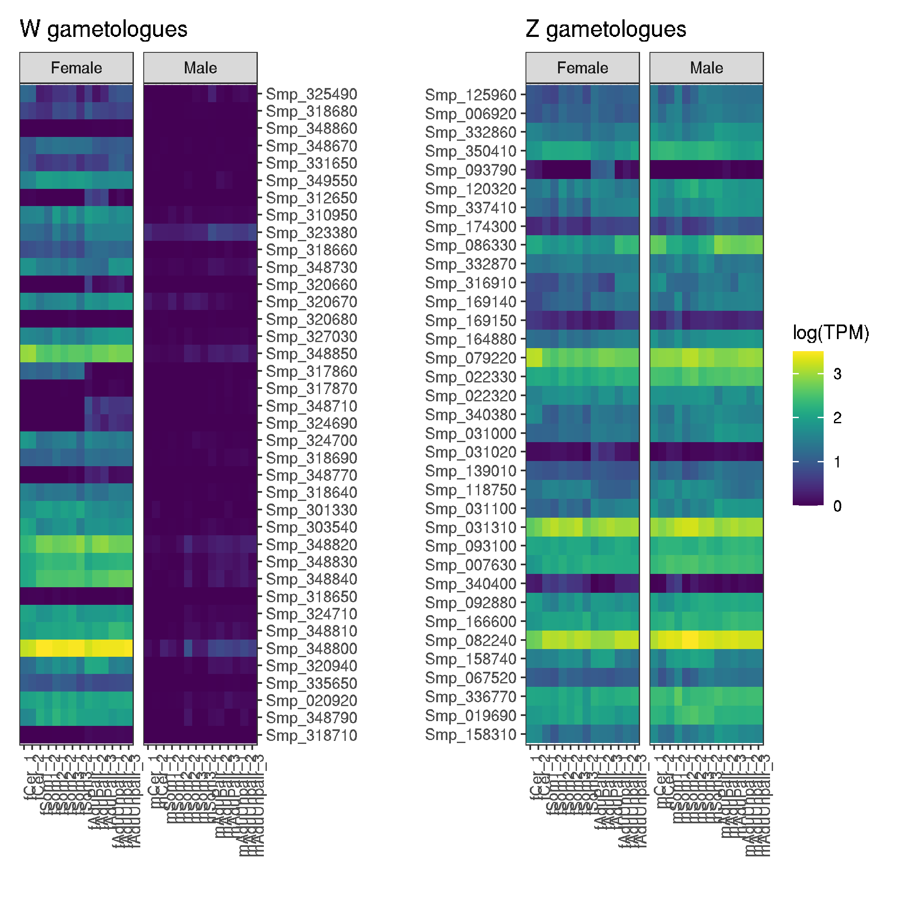

## RNAseq of Z and W gametologues from male and females

```bash
# samples from Picard et al
SRR3211868	mCer_1
SRR3216389	mCer_2
SRR3223426	mSom1_1
SRR3223427	mSom1_2
SRR3223428	mSom2_1
SRR3223429	mSom2_2
SRR3223430	mSom3_1
SRR3223431	mSom3_2
SRR3223432	mAdu_1
SRR3223433	mAdu_2
SRR3223434	fCer_1
SRR3223435	fCer_2
SRR3223436	fSom1_1
SRR3223439	fSom1_2
SRR3223443	fSom2_1
SRR3223444	fSom2_2
SRR3223445	fSom3_1
SRR3223446	fSom3_2
SRR3223447	fAdu_1
SRR3223448	fAdu_2

# samples from Lu et al
#
bf_1_9645648	12391_1#6
bf_1_9645648	12391_2#6
bf_1_9645648	13853_1#6
bf_1_9645648	13853_2#6
bf_1_9645648	13854_1#6
bf_1_9645648	13854_2#6
bf_2_9645655	12391_1#14
bf_2_9645655	12391_2#14
bf_2_9645655	13853_1#14
bf_2_9645655	13853_2#14
bf_2_9645655	13854_1#14
bf_2_9645655	13854_2#14
bf_3_9645656	12391_1#15
bf_3_9645656	12391_2#15
bf_3_9645656	13853_1#15
bf_3_9645656	13853_2#15
bf_3_9645656	13854_1#15
bf_3_9645656	13854_2#15
bm_1_9645654	12391_1#12
bm_1_9645654	12391_2#12
bm_1_9645654	13853_1#12
bm_1_9645654	13853_2#12
bm_1_9645654	13854_1#12
bm_1_9645654	13854_2#12
bm_2_9645661	12391_1#19
bm_2_9645661	12391_2#19
bm_2_9645661	13853_1#19
bm_2_9645661	13853_2#19
bm_2_9645661	13854_1#19
bm_2_9645661	13854_2#19
bm_3_9645662	12391_1#21
bm_3_9645662	12391_2#21
bm_3_9645662	13853_1#21
bm_3_9645662	13853_2#21
bm_3_9645662	13854_1#21
bm_3_9645662	13854_2#21
sf_1_9645663	12391_1#22
sf_1_9645663	12391_2#22
sf_1_9645663	13853_1#22
sf_1_9645663	13853_2#22
sf_1_9645663	13854_1#22
sf_1_9645663	13854_2#22
sf_2_9645664	12391_1#23
sf_2_9645664	12391_2#23
sf_2_9645664	13853_1#23
sf_2_9645664	13853_2#23
sf_2_9645664	13854_1#23
sf_2_9645664	13854_2#23
sf_3_9645665	12391_1#24
sf_3_9645665	12391_2#24
sf_3_9645665	13853_1#24
sf_3_9645665	13853_2#24
sf_3_9645665	13854_1#24
sf_3_9645665	13854_2#24
sm_1_9645658	12391_1#17
sm_1_9645658	12391_2#17
sm_1_9645658	13853_1#17
sm_1_9645658	13853_2#17
sm_1_9645658	13854_1#17
sm_1_9645658	13854_2#17
sm_2_9645659	12391_1#18
sm_2_9645659	12391_2#18
sm_2_9645659	13853_1#18
sm_2_9645659	13853_2#18
sm_2_9645659	13854_1#18
sm_2_9645659	13854_2#18
sm_3_9645660	12391_1#20
sm_3_9645660	12391_2#20
sm_3_9645660	13853_1#20
sm_3_9645660	13853_2#20
sm_3_9645660	13854_1#20
sm_3_9645660	13854_2#20

```


```bash
/lustre/scratch118/infgen/team133/skb/software/STAR-2.7.6a/source/STAR --runThreadN 8 --genomeDir /lustre/scratch118/infgen/team133/skb/v9/rnaseq_finalmap --readFilesIn SRR3211868.fastq.gz --readFilesCommand zcat --alignIntronMin 10 --outSAMtype BAM SortedByCoordinate --outFileNamePrefix SRR3211868_
/lustre/scratch118/infgen/team133/skb/software/STAR-2.7.6a/source/STAR --runThreadN 8 --genomeDir /lustre/scratch118/infgen/team133/skb/v9/rnaseq_finalmap --readFilesIn SRR3216389.fastq.gz --readFilesCommand zcat --alignIntronMin 10 --outSAMtype BAM SortedByCoordinate --outFileNamePrefix SRR3216389_
/lustre/scratch118/infgen/team133/skb/software/STAR-2.7.6a/source/STAR --runThreadN 8 --genomeDir /lustre/scratch118/infgen/team133/skb/v9/rnaseq_finalmap --readFilesIn SRR3223426.fastq.gz --readFilesCommand zcat --alignIntronMin 10 --outSAMtype BAM SortedByCoordinate --outFileNamePrefix SRR3223426_
/lustre/scratch118/infgen/team133/skb/software/STAR-2.7.6a/source/STAR --runThreadN 8 --genomeDir /lustre/scratch118/infgen/team133/skb/v9/rnaseq_finalmap --readFilesIn SRR3223427.fastq.gz --readFilesCommand zcat --alignIntronMin 10 --outSAMtype BAM SortedByCoordinate --outFileNamePrefix SRR3223427_
/lustre/scratch118/infgen/team133/skb/software/STAR-2.7.6a/source/STAR --runThreadN 8 --genomeDir /lustre/scratch118/infgen/team133/skb/v9/rnaseq_finalmap --readFilesIn SRR3223428.fastq.gz --readFilesCommand zcat --alignIntronMin 10 --outSAMtype BAM SortedByCoordinate --outFileNamePrefix SRR3223428_
/lustre/scratch118/infgen/team133/skb/software/STAR-2.7.6a/source/STAR --runThreadN 8 --genomeDir /lustre/scratch118/infgen/team133/skb/v9/rnaseq_finalmap --readFilesIn SRR3223429.fastq.gz --readFilesCommand zcat --alignIntronMin 10 --outSAMtype BAM SortedByCoordinate --outFileNamePrefix SRR3223429_
/lustre/scratch118/infgen/team133/skb/software/STAR-2.7.6a/source/STAR --runThreadN 8 --genomeDir /lustre/scratch118/infgen/team133/skb/v9/rnaseq_finalmap --readFilesIn SRR3223430.fastq.gz --readFilesCommand zcat --alignIntronMin 10 --outSAMtype BAM SortedByCoordinate --outFileNamePrefix SRR3223430_
/lustre/scratch118/infgen/team133/skb/software/STAR-2.7.6a/source/STAR --runThreadN 8 --genomeDir /lustre/scratch118/infgen/team133/skb/v9/rnaseq_finalmap --readFilesIn SRR3223431.fastq.gz --readFilesCommand zcat --alignIntronMin 10 --outSAMtype BAM SortedByCoordinate --outFileNamePrefix SRR3223431_
/lustre/scratch118/infgen/team133/skb/software/STAR-2.7.6a/source/STAR --runThreadN 8 --genomeDir /lustre/scratch118/infgen/team133/skb/v9/rnaseq_finalmap --readFilesIn SRR3223432.fastq.gz --readFilesCommand zcat --alignIntronMin 10 --outSAMtype BAM SortedByCoordinate --outFileNamePrefix SRR3223432_
/lustre/scratch118/infgen/team133/skb/software/STAR-2.7.6a/source/STAR --runThreadN 8 --genomeDir /lustre/scratch118/infgen/team133/skb/v9/rnaseq_finalmap --readFilesIn SRR3223433.fastq.gz --readFilesCommand zcat --alignIntronMin 10 --outSAMtype BAM SortedByCoordinate --outFileNamePrefix SRR3223433_
/lustre/scratch118/infgen/team133/skb/software/STAR-2.7.6a/source/STAR --runThreadN 8 --genomeDir /lustre/scratch118/infgen/team133/skb/v9/rnaseq_finalmap --readFilesIn SRR3223434.fastq.gz --readFilesCommand zcat --alignIntronMin 10 --outSAMtype BAM SortedByCoordinate --outFileNamePrefix SRR3223434_
/lustre/scratch118/infgen/team133/skb/software/STAR-2.7.6a/source/STAR --runThreadN 8 --genomeDir /lustre/scratch118/infgen/team133/skb/v9/rnaseq_finalmap --readFilesIn SRR3223435.fastq.gz --readFilesCommand zcat --alignIntronMin 10 --outSAMtype BAM SortedByCoordinate --outFileNamePrefix SRR3223435_
/lustre/scratch118/infgen/team133/skb/software/STAR-2.7.6a/source/STAR --runThreadN 8 --genomeDir /lustre/scratch118/infgen/team133/skb/v9/rnaseq_finalmap --readFilesIn SRR3223436.fastq.gz --readFilesCommand zcat --alignIntronMin 10 --outSAMtype BAM SortedByCoordinate --outFileNamePrefix SRR3223436_
/lustre/scratch118/infgen/team133/skb/software/STAR-2.7.6a/source/STAR --runThreadN 8 --genomeDir /lustre/scratch118/infgen/team133/skb/v9/rnaseq_finalmap --readFilesIn SRR3223439.fastq.gz --readFilesCommand zcat --alignIntronMin 10 --outSAMtype BAM SortedByCoordinate --outFileNamePrefix SRR3223439_
/lustre/scratch118/infgen/team133/skb/software/STAR-2.7.6a/source/STAR --runThreadN 8 --genomeDir /lustre/scratch118/infgen/team133/skb/v9/rnaseq_finalmap --readFilesIn SRR3223443.fastq.gz --readFilesCommand zcat --alignIntronMin 10 --outSAMtype BAM SortedByCoordinate --outFileNamePrefix SRR3223443_
/lustre/scratch118/infgen/team133/skb/software/STAR-2.7.6a/source/STAR --runThreadN 8 --genomeDir /lustre/scratch118/infgen/team133/skb/v9/rnaseq_finalmap --readFilesIn SRR3223444.fastq.gz --readFilesCommand zcat --alignIntronMin 10 --outSAMtype BAM SortedByCoordinate --outFileNamePrefix SRR3223444_
/lustre/scratch118/infgen/team133/skb/software/STAR-2.7.6a/source/STAR --runThreadN 8 --genomeDir /lustre/scratch118/infgen/team133/skb/v9/rnaseq_finalmap --readFilesIn SRR3223445.fastq.gz --readFilesCommand zcat --alignIntronMin 10 --outSAMtype BAM SortedByCoordinate --outFileNamePrefix SRR3223445_
/lustre/scratch118/infgen/team133/skb/software/STAR-2.7.6a/source/STAR --runThreadN 8 --genomeDir /lustre/scratch118/infgen/team133/skb/v9/rnaseq_finalmap --readFilesIn SRR3223446.fastq.gz --readFilesCommand zcat --alignIntronMin 10 --outSAMtype BAM SortedByCoordinate --outFileNamePrefix SRR3223446_
/lustre/scratch118/infgen/team133/skb/software/STAR-2.7.6a/source/STAR --runThreadN 8 --genomeDir /lustre/scratch118/infgen/team133/skb/v9/rnaseq_finalmap --readFilesIn SRR3223447.fastq.gz --readFilesCommand zcat --alignIntronMin 10 --outSAMtype BAM SortedByCoordinate --outFileNamePrefix SRR3223447_
/lustre/scratch118/infgen/team133/skb/software/STAR-2.7.6a/source/STAR --runThreadN 8 --genomeDir /lustre/scratch118/infgen/team133/skb/v9/rnaseq_finalmap --readFilesIn SRR3223448.fastq.gz --readFilesCommand zcat --alignIntronMin 10 --outSAMtype BAM SortedByCoordinate --outFileNamePrefix SRR3223448_


```


```bash
stringtie fCer_1_unique.bam -G /nfs/users/nfs_s/skb/SM_V9_16Mar.gff -p 5 -A fCer_1_gene_abund.out
stringtie mAdu_2_unique.bam -G /nfs/users/nfs_s/skb/SM_V9_16Mar.gff -p 5 -A mAdu_2_gene_abund.out
stringtie mCer_2_unique.bam -G /nfs/users/nfs_s/skb/SM_V9_16Mar.gff -p 5 -A mCer_2_gene_abund.out
stringtie mAdu_1_unique.bam -G /nfs/users/nfs_s/skb/SM_V9_16Mar.gff -p 5 -A mAdu_1_gene_abund.out
stringtie mCer_1_unique.bam -G /nfs/users/nfs_s/skb/SM_V9_16Mar.gff -p 5 -A mCer_1_gene_abund.out
stringtie fSom2_2_unique.bam -G /nfs/users/nfs_s/skb/SM_V9_16Mar.gff -p 5 -A fSom2_2_gene_abund.out
stringtie fSom3_2_unique.bam -G /nfs/users/nfs_s/skb/SM_V9_16Mar.gff -p 5 -A fSom3_2_gene_abund.out
stringtie fSom1_2_unique.bam -G /nfs/users/nfs_s/skb/SM_V9_16Mar.gff -p 5 -A fSom1_2_gene_abund.out
stringtie fSom1_1_unique.bam -G /nfs/users/nfs_s/skb/SM_V9_16Mar.gff -p 5 -A fSom1_1_gene_abund.out
stringtie fSom2_1_unique.bam -G /nfs/users/nfs_s/skb/SM_V9_16Mar.gff -p 5 -A fSom2_1_gene_abund.out
stringtie mSom2_1_unique.bam -G /nfs/users/nfs_s/skb/SM_V9_16Mar.gff -p 5 -A mSom2_1_gene_abund.out
stringtie fSom3_1_unique.bam -G /nfs/users/nfs_s/skb/SM_V9_16Mar.gff -p 5 -A fSom3_1_gene_abund.out
stringtie mSom2_2_unique.bam -G /nfs/users/nfs_s/skb/SM_V9_16Mar.gff -p 5 -A mSom2_2_gene_abund.out
stringtie mSom3_1_unique.bam -G /nfs/users/nfs_s/skb/SM_V9_16Mar.gff -p 5 -A mSom3_1_gene_abund.out
stringtie mSom3_2_unique.bam -G /nfs/users/nfs_s/skb/SM_V9_16Mar.gff -p 5 -A mSom3_2_gene_abund.out
stringtie mSom1_1_unique.bam -G /nfs/users/nfs_s/skb/SM_V9_16Mar.gff -p 5 -A mSom1_1_gene_abund.out
stringtie fAdu_1_unique.bam -G /nfs/users/nfs_s/skb/SM_V9_16Mar.gff -p 5 -A fAdu_1_gene_abund.out
stringtie mSom1_2_unique.bam -G /nfs/users/nfs_s/skb/SM_V9_16Mar.gff -p 5 -A mSom1_2_gene_abund.out
stringtie fAdu_2_unique.bam -G /nfs/users/nfs_s/skb/SM_V9_16Mar.gff -p 5 -A fAdu_2_gene_abund.out
stringtie fCer_2_unique.bam -G /nfs/users/nfs_s/skb/SM_V9_16Mar.gff -p 5 -A fCer_2_gene_abund.out

stringtie bf_3_unique.bam -G /nfs/users/nfs_s/skb/SM_V9_16Mar.gff -p 10 -A bf_3_unique.bam_gene_abund.out
stringtie bf_2_unique.bam -G /nfs/users/nfs_s/skb/SM_V9_16Mar.gff -p 10 -A bf_2_unique.bam_gene_abund.out
stringtie sm_3_unique.bam -G /nfs/users/nfs_s/skb/SM_V9_16Mar.gff -p 10 -A sm_3_unique.bam_gene_abund.out
stringtie bm_3_unique.bam -G /nfs/users/nfs_s/skb/SM_V9_16Mar.gff -p 10 -A bm_3_unique.bam_gene_abund.out
stringtie bm_2_unique.bam -G /nfs/users/nfs_s/skb/SM_V9_16Mar.gff -p 10 -A bm_2_unique.bam_gene_abund.out
stringtie sm_1_unique.bam -G /nfs/users/nfs_s/skb/SM_V9_16Mar.gff -p 10 -A sm_1_unique.bam_gene_abund.out
stringtie sf_1_unique.bam -G /nfs/users/nfs_s/skb/SM_V9_16Mar.gff -p 10 -A sf_1_unique.bam_gene_abund.out
stringtie sm_2_unique.bam -G /nfs/users/nfs_s/skb/SM_V9_16Mar.gff -p 10 -A sm_2_unique.bam_gene_abund.out
stringtie sf_3_unique.bam -G /nfs/users/nfs_s/skb/SM_V9_16Mar.gff -p 10 -A sf_3_unique.bam_gene_abund.out
stringtie bm_1_unique.bam -G /nfs/users/nfs_s/skb/SM_V9_16Mar.gff -p 10 -A bm_1_unique.bam_gene_abund.out
stringtie sf_2_unique.bam -G /nfs/users/nfs_s/skb/SM_V9_16Mar.gff -p 10 -A sf_2_unique.bam_gene_abund.out
stringtie bf_1_unique.bam -G /nfs/users/nfs_s/skb/SM_V9_16Mar.gff -p 10 -A bf_1_unique.bam_gene_abund.out
stringtie bf_1_unique.bam -G /nfs/users/nfs_s/skb/SM_V9_16Mar.gff -p 10 -A bf_1_unique.bam_gene_abund.out


# fix up the names of the second batch

for i in *_unique.bam_gene_abund.out; do
     mv $i ${i%_unique.bam_gene_abund.out}_gene_abund.out;
     done

# rename then to be consistent with the first batch
mv bm_1_gene_abund.out mAduPair_1_gene_abund.out
mv bm_2_gene_abund.out mAduPair_2_gene_abund.out
mv bm_3_gene_abund.out mAduPair_3_gene_abund.out
mv bf_3_gene_abund.out fAduPair_3_gene_abund.out
mv bf_2_gene_abund.out fAduPair_2_gene_abund.out
mv bf_1_gene_abund.out fAduPair_1_gene_abund.out
mv sf_1_gene_abund.out fAduUnpair_1_gene_abund.out
mv sf_2_gene_abund.out fAduUnpair_2_gene_abund.out
mv sf_3_gene_abund.out fAduUnpair_3_gene_abund.out
mv sm_3_gene_abund.out mAduUnpair_3_gene_abund.out
mv sm_2_gene_abund.out mAduUnpair_2_gene_abund.out
mv sm_1_gene_abund.out mAduUnpair_1_gene_abund.out

```


```bash
> sex.stage.z_genes.data.txt
n=0
while read GENE; do \
     n=$((n + 1)); \
     for STAGE in mCer_1_gene_abund.out \
          mCer_2_gene_abund.out \
          mSom1_1_gene_abund.out \
          mSom1_2_gene_abund.out \
          mSom2_1_gene_abund.out \
          mSom2_2_gene_abund.out \
          mSom3_1_gene_abund.out \
          mSom3_2_gene_abund.out \
          mAduPair_1_gene_abund.out \
          mAduPair_2_gene_abund.out \
          mAduPair_3_gene_abund.out \
          mAduUnpair_1_gene_abund.out \
          mAduUnpair_2_gene_abund.out \
          mAduUnpair_3_gene_abund.out \
          fCer_1_gene_abund.out \
          fCer_2_gene_abund.out \
          fSom1_1_gene_abund.out \
          fSom1_2_gene_abund.out \
          fSom2_1_gene_abund.out \
          fSom2_2_gene_abund.out \
          fSom3_1_gene_abund.out \
          fSom3_2_gene_abund.out \
          fAduPair_1_gene_abund.out \
          fAduPair_2_gene_abund.out \
          fAduPair_3_gene_abund.out \
          fAduUnpair_1_gene_abund.out \
          fAduUnpair_2_gene_abund.out \
          fAduUnpair_3_gene_abund.out; do
               SEX=$(echo ${STAGE} | cut -c1) ;
               grep "${GENE}" ${STAGE} |\
               awk -v COUNT=${n} -v STAGE=${STAGE%_gene_abund.out} -v SEX=${SEX} '{print SEX,STAGE,$1,$9,COUNT}' OFS="\t" \
               >> sex.stage.z_genes.data.txt;
               done ;
          done < z_genes.list

> sex.stage.w_genes.data.txt
n=0
while read GENE; do \
     n=$((n + 1)); \
     for STAGE in mCer_1_gene_abund.out \
          mCer_2_gene_abund.out \
          mSom1_1_gene_abund.out \
          mSom1_2_gene_abund.out \
          mSom2_1_gene_abund.out \
          mSom2_2_gene_abund.out \
          mSom3_1_gene_abund.out \
          mSom3_2_gene_abund.out \
          mAduPair_1_gene_abund.out \
          mAduPair_2_gene_abund.out \
          mAduPair_3_gene_abund.out \
          mAduUnpair_1_gene_abund.out \
          mAduUnpair_2_gene_abund.out \
          mAduUnpair_3_gene_abund.out \
          fCer_1_gene_abund.out \
          fCer_2_gene_abund.out \
          fSom1_1_gene_abund.out \
          fSom1_2_gene_abund.out \
          fSom2_1_gene_abund.out \
          fSom2_2_gene_abund.out \
          fSom3_1_gene_abund.out \
          fSom3_2_gene_abund.out \
          fAduPair_1_gene_abund.out \
          fAduPair_2_gene_abund.out \
          fAduPair_3_gene_abund.out \
          fAduUnpair_1_gene_abund.out \
          fAduUnpair_2_gene_abund.out \
          fAduUnpair_3_gene_abund.out; do
               SEX=$(echo ${STAGE} | cut -c1) ;
               grep "${GENE}" ${STAGE} |\
               awk -v COUNT=${n} -v STAGE=${STAGE%_gene_abund.out} -v SEX=${SEX} '{print SEX,STAGE,$1,$9,COUNT}' OFS="\t" \
               >> sex.stage.w_genes.data.txt;
               done ;
          done < w_genes.list
```

## make some plots
```R
# load libraries
library(tidyverse)
library(patchwork)
library(viridis)

# import w data
data_w <- read.table("sex.stage.w_genes.data.txt", header=F)

# generate some labels to replace coded names
labels <- c("Female","Male")
names(labels) <- c("f","m")

# want to order the samples on the x axis by lifestage in order. Can set the order here, and call it from ggplot
level_order <- c('mCer_1', 'mCer_2', 'mSom1_1', 'mSom1_2', 'mSom2_1', 'mSom2_2', 'mSom3_1', 'mSom3_2', 'mAduPair_1','mAduPair_2','mAduPair_3','mAduUnpair_1','mAduUnpair_2','mAduUnpair_3', 'fCer_1', 'fCer_2', 'fSom1_1', 'fSom1_2', 'fSom2_1', 'fSom2_2', 'fSom3_1', 'fSom3_2', 'fAduPair_1', 'fAduPair_2', 'fAduPair_3', 'fAduUnpair_1', 'fAduUnpair_2', 'fAduUnpair_3')

# plot w data
plot_w <- ggplot(data_w) +
     geom_tile(aes(factor(V2, level=level_order),reorder(V3, -V5),fill=log10(V4+1))) +
          facet_grid(.~V1, scales="free_x", labeller = labeller(V1 = labels)) +
          scale_fill_viridis() +
          theme_bw() + theme(axis.text.x=element_text(angle=90, hjust=1)) +
          labs(y="", x="", fill="log(TPM)", title="W gametologues") +
          scale_y_discrete(position = "right")


# import z data
data_z <- read.table("sex.stage.z_genes.data.txt", header=F)

# plot z data
plot_z <- ggplot(data_z) +
     geom_tile(aes(factor(V2, level=level_order),reorder(V3, -V5),fill=log10(V4+1))) +
          facet_grid(.~V1, scales="free_x", labeller = labeller(V1 = labels))  +
          scale_fill_viridis() +
          theme_bw() + theme(axis.text.x=element_text(angle=90, hjust=1), legend.position="none") +
          labs(y="", x="", fill="log10(TPM)", title="Z gametologues")

# comine the plots using patchwork
plot_w + plot_z + plot_layout(guides = 'collect')

# save it
ggsave("W_Z_gametologues_RNAseq.pdf", height=5, width=7)
ggsave("W_Z_gametologues_RNAseq.png")
```



### heatmap of Z ancestral genes
```bash
cat ../SM_V9_16Mar.gff | grep "SM_V9_Z" | awk '{if($3=="gene" && $4>13993393 && $5<33063208) print}' | cut -f9 | cut -c4-13 > Z_ancestral.gene.list

> sex.stage.z_ancestral_genes.data.txt
n=0
while read GENE; do \
     n=$((n + 1)); \
     for STAGE in mCer_1_gene_abund.out \
          mCer_2_gene_abund.out \
          mSom1_1_gene_abund.out \
          mSom1_2_gene_abund.out \
          mSom2_1_gene_abund.out \
          mSom2_2_gene_abund.out \
          mSom3_1_gene_abund.out \
          mSom3_2_gene_abund.out \
          mAduPair_1_gene_abund.out \
          mAduPair_2_gene_abund.out \
          mAduPair_3_gene_abund.out \
          mAduUnpair_1_gene_abund.out \
          mAduUnpair_2_gene_abund.out \
          mAduUnpair_3_gene_abund.out \
          fCer_1_gene_abund.out \
          fCer_2_gene_abund.out \
          fSom1_1_gene_abund.out \
          fSom1_2_gene_abund.out \
          fSom2_1_gene_abund.out \
          fSom2_2_gene_abund.out \
          fSom3_1_gene_abund.out \
          fSom3_2_gene_abund.out \
          fAduPair_1_gene_abund.out \
          fAduPair_2_gene_abund.out \
          fAduPair_3_gene_abund.out \
          fAduUnpair_1_gene_abund.out \
          fAduUnpair_2_gene_abund.out \
          fAduUnpair_3_gene_abund.out; do
               SEX=$(echo ${STAGE} | cut -c1) ;
               grep "${GENE}" ${STAGE} |\
               awk -v COUNT=${n} -v STAGE=${STAGE%_gene_abund.out} -v SEX=${SEX} '{print SEX,STAGE,$1,$9,COUNT}' OFS="\t" \
               >> sex.stage.z_ancestral_genes.data.txt;
               done ;
          done < Z_ancestral.gene.list

```


```R
# load libraries
library(tidyverse)
library(patchwork)
library(viridis)

# import w data
data <- read.table("sex.stage.z_ancestral_genes.data.txt", header=F)

# generate some labels to replace coded names
labels <- c("Female","Male")
names(labels) <- c("f","m")

# want to order the samples on the x axis by lifestage in order. Can set the order here, and call it from ggplot
level_order <- c('mCer_1', 'mCer_2', 'mSom1_1', 'mSom1_2', 'mSom2_1', 'mSom2_2', 'mSom3_1', 'mSom3_2', 'mAduPair_1','mAduPair_2','mAduPair_3','mAduUnpair_1','mAduUnpair_2','mAduUnpair_3', 'fCer_1', 'fCer_2', 'fSom1_1', 'fSom1_2', 'fSom2_1', 'fSom2_2', 'fSom3_1', 'fSom3_2', 'fAduPair_1', 'fAduPair_2', 'fAduPair_3', 'fAduUnpair_1', 'fAduUnpair_2', 'fAduUnpair_3')

# plot w data
plot <- ggplot(data) +
     geom_tile(aes(factor(V2, level=level_order),reorder(V3, -V5),fill=log2(V4+1))) +
          facet_grid(.~V1, scales="free_x", labeller = labeller(V1 = labels)) +
          scale_fill_viridis() +
          theme_bw() + theme(axis.text.x=element_text(angle=90, hjust=1)) +
          labs(y="", x="", fill="log(TPM)", title="Z-linked ancestral genes") +
          scale_y_discrete(position = "right")
plot
```


cat mb_omega.gff | cut -f9 | cut -c 4-13 | sort | uniq > omega.gene.ids.list
cat mb_IPSE.gff | cut -f9 | cut -c 4-13 | sort | uniq > ipse.gene.ids.list

```bash
> sex.stage.ipse_genes.data.txt
n=0
while read GENE; do \
     n=$((n + 1)); \
     for STAGE in mCer_1_gene_abund.out \
          mCer_2_gene_abund.out \
          mSom1_1_gene_abund.out \
          mSom1_2_gene_abund.out \
          mSom2_1_gene_abund.out \
          mSom2_2_gene_abund.out \
          mSom3_1_gene_abund.out \
          mSom3_2_gene_abund.out \
          mAduPair_1_gene_abund.out \
          mAduPair_2_gene_abund.out \
          mAduPair_3_gene_abund.out \
          mAduUnpair_1_gene_abund.out \
          mAduUnpair_2_gene_abund.out \
          mAduUnpair_3_gene_abund.out \
          fCer_1_gene_abund.out \
          fCer_2_gene_abund.out \
          fSom1_1_gene_abund.out \
          fSom1_2_gene_abund.out \
          fSom2_1_gene_abund.out \
          fSom2_2_gene_abund.out \
          fSom3_1_gene_abund.out \
          fSom3_2_gene_abund.out \
          fAduPair_1_gene_abund.out \
          fAduPair_2_gene_abund.out \
          fAduPair_3_gene_abund.out \
          fAduUnpair_1_gene_abund.out \
          fAduUnpair_2_gene_abund.out \
          fAduUnpair_3_gene_abund.out; do
               SEX=$(echo ${STAGE} | cut -c1) ;
               grep "${GENE}" ${STAGE} |\
               awk -v COUNT=${n} -v STAGE=${STAGE%_gene_abund.out} -v SEX=${SEX} '{print SEX,STAGE,$1,$9,COUNT}' OFS="\t" \
               >> sex.stage.ipse_genes.data.txt;
               done ;
          done < ipse.gene.ids.list

```
