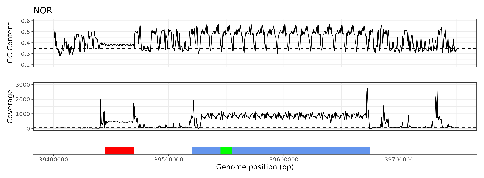
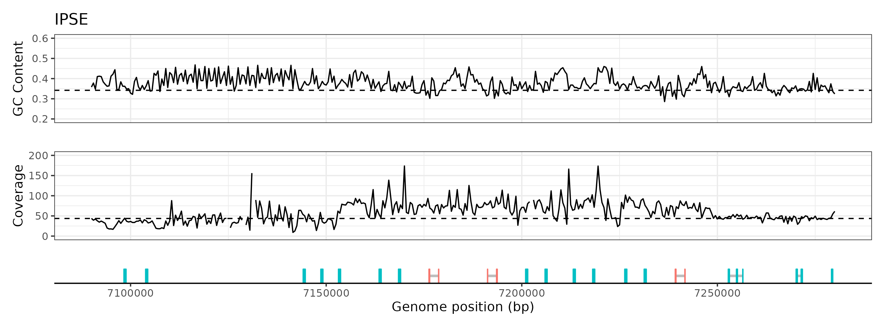
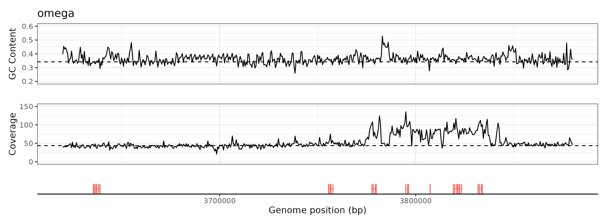

# Schistosoma mansoni V10 genome: Coverage plots of repetitive regions: NOR, IPSE and Omega

### author: Stephen Doyle, stephen.doyle[at]sanger.ac.uk

```bash
# working directory
cd /nfs/users/nfs_s/sd21/lustre118_link/schistosoma_mansoni/COV

# get the reference and index it, using the index file to make a genome file for bedtools
cp ../SM_V9_21Feb.fa .

samtools faidx SM_V9_21Feb.fa

cut -f1,2 SM_V9_21Feb.fa.fai > SM_V9.genome

# extract bed coordinates for the genome in 500 bp windows
bedtools makewindows -g SM_V9.genome -w 500 > SM_V9.500b.bed


# nucleotide frequency
bedtools nuc -fi SM_V9_21Feb.fa -bed SM_V9.500b.bed > SM_V9.500b.nucfreq

#--- extract nucleotide frequency data for chromosome 1
grep 'SM_V9_1' SM_V9.500b.nucfreq > SM_V9_1.500b.nucfreq

#--- extract nucleotide frequency data for  chromosome 2
grep 'SM_V9_2' SM_V9.500b.nucfreq > SM_V9_2.500b.nucfreq


# get mapped data from the single female
ln -s ../BAMS/6520_5_1_sorted.bam
ln -s ../BAMS/6520_5_1_sorted.bam.bai

# calculate genome coverage in 500 bp windows
samtools bedcov SM_V9.500b.bed 6520_5_1_sorted.bam > SM_V9.500b.coverage &

#--- extract coverage data for chromosome 1
grep 'SM_V9_1' SM_V9.500b.coverage > SM_V9_1.500b.coverage

#--- extract  coverage data for chromosome 2
grep 'SM_V9_2' SM_V9.500b.coverage > SM_V9_2.500b.coverage

#--- extract  coverage data for chromosome 2
grep 'SM_V9_Z' SM_V9.500b.coverage > SM_V9_Z.500b.coverage


# extract coordinate data for CDS for IPSE and omega
cd ~/lustre118_link/schistosoma_mansoni/REPEATS
cat mb_IPSE.gff | awk -F '[\t;]' '{print $1,$4,$5,$7,$9,$11}' OFS="\t" | sed 's/ID=//g' > mb_IPSE.bed

cat mb_omega.gff | awk -F '[\t;]' '{print $1,$4,$5,$7,$9,$11}' OFS="\t" | sed 's/ID=//g' > mb_omega.bed

```


### NOR plot
```R
# load libraries
library(tidyverse)
library(patchwork)

# load nucleotide frequency data, and calculate median GC
nuc <- read.table("SM_V9_2.500b.nucfreq", header=F)
nuc_median <- median(nuc$V5)

# load coverage data, and calculate median coverage
cov <- read.table("SM_V9_2.500b.coverage", header=F)
cov_median <- median(cov$V4/500)


# make some plots
plot_nuc <- ggplot(nuc) +
     geom_line(aes(V2, V5), size=0.75) +
     xlim(39.4e6, 39.75e6) +
     ylim(0.2, 0.6) +
     theme_bw() + guides(x = "none") +
     labs(x="", y="GC Content", title="NOR") +
     geom_hline(yintercept=nuc_median, linetype="dashed")

plot_cov <- ggplot(cov) +
     geom_line(aes(V2, V4/500), size=0.75) +
     xlim(39.4e6, 39.75e6) +
     ylim(0, 3000) +
     theme_bw() + guides(x = "none") +
     labs(x="", y="Coverage")  +
     geom_hline(yintercept=cov_median, linetype="dashed")

plot_feature <- ggplot() +
     geom_rect(aes(xmin=39.445e6, xmax=39.47e6, ymin=0.5, ymax=1.5), fill="red") +
     geom_rect(aes(xmin=39.52e6, xmax=39.675e6, ymin=0.5, ymax=1.5), fill="cornflowerblue") +
     geom_rect(aes(xmin=39.545e6, xmax=39.555e6, ymin=0.5, ymax=1.5), fill="green") +
     theme_classic() +
     guides(y = "none") + theme(legend.position="none") +
     xlim(39.4e6, 39.75e6) +
     labs(x="Genome position (bp)", y="")


# combine into multipanel
plot_nuc + plot_cov + plot_feature + plot_layout(ncol=1, heights=c(3,3,1))

ggsave("figure_NOR.gc.coverage.pdf", height=100, width=170, units="mm")
ggsave("figure_NOR.gc.coverage.png")
```



### IPSE plot
```R
# load libraries
library(tidyverse)
library(patchwork)

# load gene data, and determine min and max coords per gene
gene <- read.table("mb_IPSE.bed", header=F)
gene_summary <- gene %>% group_by(V5) %>% summarise(min=min(V2), max=max(V3), strand=V4)

# load nucleotide frequency data, and calculate median GC
nuc <- read.table("SM_V9_1.500b.nucfreq", header=F)
nuc_median <- median(nuc$V5)

# load coverage data, and calculate median coverage
cov <- read.table("SM_V9_1.500b.coverage", header=F)
cov_median <- median(cov$V4/500)

# make some plots
plot_nuc <- ggplot(nuc) +
     geom_line(aes(V2, V5), linewidth=0.75) +
     xlim(7090000, 7280000) +
     ylim(0.2, 0.6) +
     theme_bw() + guides(x = "none") + labs(x="", y="GC Content", title="IPSE") +
     geom_hline(yintercept=nuc_median, linetype="dashed")

plot_cov <- ggplot(cov) +
     geom_line(aes(V2, V4/500), linewidth=0.75) +
     xlim(7090000, 7280000) + ylim(0,200) +
     theme_bw() + guides(x = "none") +
     labs(x="", y="Coverage")  +
     geom_hline(yintercept=cov_median, linetype="dashed")

plot_gene <- ggplot() +
     geom_segment(data=gene_summary, aes(x=min, xend=max, y=1, yend=1), size=1, col="grey") +
     geom_rect(data=gene, aes(xmin=V2, xmax=V3, ymin=0.5, ymax=1.5, col=as.factor(V6))) +
     theme_classic() +
     guides(y = "none") + theme(legend.position="none") +
     xlim(7090000, 7280000) +
     labs(x="Genome position (bp)", y="")

# combine into multipanel
plot_nuc + plot_cov + plot_gene + plot_layout(ncol=1, heights=c(3,3,1))

ggsave("figure_IPSE.gc.coverage.pdf", height=100, width=170, units="mm")
ggsave("figure_IPSE.gc.coverage.png")
```



# OMEGA plot
```R
# load libraries
library(tidyverse)
library(patchwork)


# load gene data, and determine min and max coords per gene
gene <- read.table("mb_omega.bed", header=F)
gene_summary <- gene %>% group_by(V5) %>% summarise(min=min(V2), max=max(V3), strand=V4)


# load nucleotide frequency data, and calculate median GC
nuc <- read.table("SM_V9_1.500b.nucfreq", header=F)
nuc_median <- median(nuc$V5)

# load coverage data, and calculate median coverage
cov <- read.table("SM_V9_1.500b.coverage", header=F)
cov_median <- median(cov$V4/500)

# make some plots
plot_nuc <- ggplot(nuc) +
     geom_line(aes(V2, V5), size=0.75) +
     xlim(3620000, 3880000) +
     ylim(0.2, 0.6) +
     theme_bw() + guides(x = "none") + labs(x="", y="GC Content", title="omega") +
     geom_hline(yintercept=nuc_median, linetype="dashed")

plot_cov <- ggplot(cov) +
     geom_line(aes(V2, V4/500), size=0.75) +
     xlim(3620000, 3880000) +
     ylim(0, 150) +
     theme_bw() + guides(x = "none") + labs(x="", y="Coverage")  +
     geom_hline(yintercept=cov_median, linetype="dashed")

plot_gene <- ggplot() +
     geom_segment(data=gene_summary, aes(x=min, xend=max, y=1, yend=1), size=1, col="grey") +
     geom_rect(data=gene, aes(xmin=V2, xmax=V3, ymin=0.5, ymax=1.5, col=as.factor(V6))) +
     theme_classic() +
     guides(y = "none") + theme(legend.position="none") +
     xlim(3620000, 3880000) +
     labs(x="Genome position (bp)", y="")

# combine into multipanel
plot_nuc + plot_cov + plot_gene + plot_layout(ncol=1, heights=c(3,3,1))

ggsave("figure_omega.gc.coverage.pdf", height=100, width=170, units="mm")
ggsave("figure_omega.gc.coverage.png")
```



# recreating HIC maps of chromosome 1 and WSR
```bash
bsub.py --queue yesterday --threads 7 10 minimap_sr "minimap2 -t 7 -ax sr ../V9/smansoni_buddenborg2021_genome.fa  32442_4#1_1.fastq.gz 32442_4#1_2.fastq.gz -o minimap.sam"

samtools view -H minimap.sam > tmp

cat minimap.sam | grep "WSR" > WSR.sam
cat minimap.sam | grep "SM_V9_1" > SM_V9_1.sam

samtools view -H minimap.sam > tmp
cat tmp WSR.sam > tmp2; mv tmp2 WSR.sam
cat tmp SM_V9_1.sam > tmp2; mv tmp2 SM_V9_1.sam

samtools sort -n -o WSR.sorted.bam WSR.bam
samtools sort -n -o SM_V9_1.sorted.sam SM_V9_1.sam

samtools view -f 64 WSR.sorted.bam | awk '{if($3=="SM_V9_WSR" && $7=="=") print $1,$4,$5,$9}' OFS="\t" > WSR.sorted.txt
samtools view -f 64 SM_V9_1.sorted.sam | awk '{if($3=="SM_V9_1" && $7=="=") print $1,$4,$5,$9}' OFS="\t" > SM_V9_1.sorted.txt
```

```R
library(tidyverse)
library(viridis)
library(patchwork)

#data <- read.table("WSR.sorted.txt", header=F, sep="\t")
data <- read.table("SM_V9_1.sorted.txt", header=F, sep="\t")
data <- filter(data, V3>0)
data2 <- mutate(data, midpoint = if_else(V4>0, V2+(V4/2), V2-(-V4/2)))
data2 <- mutate(data2, distance = abs(V4))

#ggplot(data2) + geom_hex(aes(V2+(V4/2),V4),bins = 75) + scale_fill_viridis(direction = -1)
plot_1 <- ggplot(data2) + geom_hex(aes(midpoint,distance),bins = 75) + scale_fill_viridis(direction = -1)
plot_2 <- ggplot(data2) + geom_hex(aes(midpoint,log10(distance)),bins = 75) + scale_fill_viridis(direction = -1)

plot_1 + plot_2 + plot_layout(ncol=1)


data <- read.table("WSR.sorted.txt", header=F, sep="\t")
#data <- read.table("SM_V9_1.sorted.txt", header=F, sep="\t")
data <- filter(data, V3>0)
data2 <- mutate(data, midpoint = if_else(V4>0, V2+(V4/2), V2-(-V4/2)))
data2 <- mutate(data2, distance = abs(V4))

#ggplot(data2) + geom_hex(aes(V2+(V4/2),V4),bins = 75) + scale_fill_viridis(direction = -1)
plot_3 <- ggplot(data2) + geom_hex(aes(midpoint,distance),bins = 75) + scale_fill_viridis(direction = -1)
plot_4 <- ggplot(data2) + geom_hex(aes(midpoint,log10(distance)),bins = 75) + scale_fill_viridis(direction = -1)

plot_1 + plot_2 + plot_3 + plot_4 + plot_layout(ncol=1)
```
