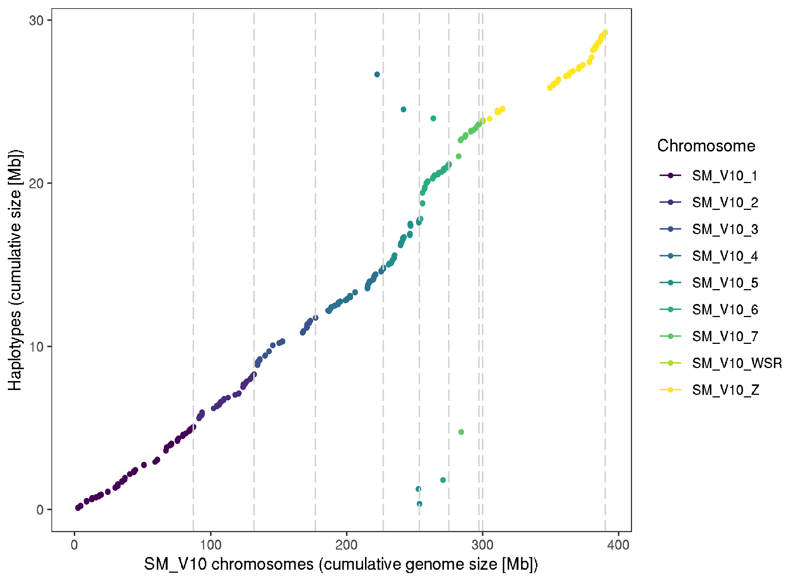

# Schistosoma mansoni V10 genome: haplotypes


## Get data
```bash 
cd /nfs/users/nfs_s/sd21/lustre118_link/schistosoma_mansoni/V10/V9_HAPLOTYPES

# get previously characterised V9 haplotypes stored in zenodo for previous genome paper submission
# https://doi.org/10.5281/zenodo.5149023

wget https://zenodo.org/record/5149023/files/SM_V9_haplotypes.fa
wget https://zenodo.org/record/5149023/files/SM_V9_haplotypes.gff

ln -s ~/lustre118_link/schistosoma_mansoni/V10/REF/SM_V10.genome.preWBP18checked.fa


# gff stats on haplotypes
cut -f3 SM_V9_haplotypes.gff | sort | uniq -c | grep -v "#"
#      4
#   1779 CDS
#   2158 exon
#    352 five_prime_UTR
#    301 gene
#    364 mRNA
#    362 three_prime_UTR
```
- 301 genes on haplotypes to place on main assembly


## Gene comparison
```bash
conda activate liftoff

bsub.py 10 liftoff_v9haplo_v10 "liftoff -g SM_V9_haplotypes.gff -o V9haplo_to_V10.liftoff.gff3 SM_V10.genome.preWBP18checked.fa SM_V9_haplotypes.fa"

conda deactivate 


# 4 genes unmapped
Smp_329820
Smp_316650
Smp_194070
Smp_330920
```

## compare lited over genes against V10 annotation
```bash
# from V5 to V10 liftoff comparison
cp ../V5_vs_V10/LIFTOFF/V10.clean_annotation.gff3 .

# run gff compare between V5 transferred and V10 annotations
gffcompare -r V10.clean_annotation.gff3 V9haplo_to_V10.liftoff.gff3


awk '{if($3=="-") print}' gffcmp.loci | wc -l
# 38 genes without a V10 overlap
# need to check if these are novel, or potentially rubbish
# note - actually 39 genes in the list, Smp_321200.1,Smp_321210.1 both map to the same locus

# comparison of gene IDs - using the same code as th V5 to V10 comparison, so ignore the V5 references
awk -F '[\t ,]' '{if($3!="-") print NF, $0 }' gffcmp.loci | sort | uniq -c | sed -e 's/\.[123456789]//g' -e 's/transcript://g'  | cut -f3,4 | while read V10 V5; do
     # V10 gene ID
     V10_gene=$( echo ${V10} | sed -e 's/,/\n/g' -e 's/|/\n/g' | sed -n '0~2p' | sort | uniq )
     # V10 gene count
     V10_gene_n=$( echo ${V10} | sed -e 's/,/\n/g' -e 's/|/\n/g' | sed -n '0~2p' | sort | uniq | wc -l )
     # V5 gene ID
     V5_gene=$( echo ${V5} | sed 's/,/\n/g' | sort | uniq )
     # V5 gene count
     V5_gene_n=$( echo ${V5} | sed 's/,/\n/g' | sort | uniq | wc -l )
     
     # is the gene ID the same?
     if [[ ${V10_gene} == ${V5_gene} ]]; then
     echo -e "same_ID"",""V5"","${V5_gene}","${V5_gene_n}",""V10"","${V10_gene}","${V10_gene_n};
     
     # same gene, different id?
     elif [[ ${V10_gene_n} -eq "1" ]] && [[ ${V5_gene_n} -eq "1" ]] && [[ ${V10_gene} != ${V5_gene} ]]; then
     echo -e "diff_ID"",""V5"","${V5_gene}","${V5_gene_n}",""V10"","${V10_gene}","${V10_gene_n};
     elif [[ ${V10_gene_n} -eq ${V5_gene_n} ]] && [[ ${V10_gene} != ${V5_gene} ]]; then
     echo -e "diff_ID_complex"",""V5"","${V5_gene}","${V5_gene_n}",""V10"","${V10_gene}","${V10_gene_n};

     # split in v10?
     elif [ ${V10_gene_n} -gt ${V5_gene_n} ] && [[ ${V5_gene_n} -eq "1" ]]; then
     echo -e "split_in_V10_simple"",""V5"","${V5_gene}","${V5_gene_n}",""V10"","${V10_gene}","${V10_gene_n};
     elif [ ${V10_gene_n} -gt ${V5_gene_n} ] && [[ ${V5_gene_n} -gt "1" ]]; then
     echo -e "split_in_V10_complex"",""V5"","${V5_gene}","${V5_gene_n}",""V10"","${V10_gene}","${V10_gene_n};
     
     elif [ ${V10_gene_n} -lt ${V5_gene_n} ] && [[ ${V10_gene_n} -eq "1" ]]; then
     echo -e "merged_in_V10_simple"",""V5"","${V5_gene}","${V5_gene_n}",""V10"","${V10_gene}","${V10_gene_n};
     elif [ ${V10_gene_n} -lt ${V5_gene_n} ] && [[ ${V10_gene_n} -gt "1" ]]; then
     echo -e "merged_in_V10_complex"",""V5"","${V5_gene}","${V5_gene_n}",""V10"","${V10_gene}","${V10_gene_n};

     fi;
     done > V9haplo_2_V10_same_split_merged.txt

cut -f1 -d "," V9haplo_2_V10_same_split_merged.txt | sort | uniq -c

#    236 diff_ID
#      6 merged_in_V10_simple - fragmented in haplotpes, merged in V10
#     10 split_in_V10_simple - over merged in haplotype, split in V10

# as the split and merged genes contain multiple V10 genes, can find the total genes represented in V9haplo and V10
cat V9haplo_2_V10_same_split_merged.txt | datamash -t "," sum 4 sum 7
# 258,263

```
- Summary
    - 258 genes
        - 236 different ID - this is expected, but these are a match for position
        - 6 merged_in_V10_simple - fragmented in haplotpes, merged in V10
        - 10 split_in_V10_simple - over merged in haplotype, split in V10
    - 4 not transferred - need to check protein sequence of these
    - 39 genes without a V10 overlap - also need to check these 
    - total: 301 genes - which is all of the genes in the haplotypes


## checking genes transferred with no V10 overlap 
 ```bash
XLOC_000017	SM_V10_1[+]71056900-71059470	-	Smp_309910.1,Smp_309910.2,Smp_309910.3 - no evidence
XLOC_000021	SM_V10_1[+]79452374-79455839	-	Smp_320930.1 -  no evidence
XLOC_000048	SM_V10_2[+]13955325-13959848	-	Smp_326940.1 - no evidence
XLOC_000063	SM_V10_2[-]1623703-1626842	-	Smp_321120.1 - no evidence
XLOC_000066	SM_V10_2[-]5631833-5633017	-	Smp_317880.2,Smp_317880.1 - proabably lncRNA - no protein coding
XLOC_000073	SM_V10_2[-]35481345-35482766	-	Smp_324820.1 - no evidence
XLOC_000075	SM_V10_2[-]35569442-35575346	-	Smp_332770.1 - no evidece 
XLOC_000076	SM_V10_2[-]35584630-35588640	-	Smp_325080.1,Smp_325080.2 - no evidence
XLOC_000083	SM_V10_3[+]95143-96086	-	Smp_324950.1 - no evidence
XLOC_000107	SM_V10_3[-]344380-344781	-	Smp_307460.1 - no evidence
XLOC_000110	SM_V10_3[-]848224-857000	-	Smp_337700.1 - proabably lncRNA - no protein coding
XLOC_000112	SM_V10_3[-]1024366-1028321	-	Smp_305410.1 - no evidence
XLOC_000123	SM_V10_4[+]4510270-4512872	-	Smp_324880.1 - no evidence
XLOC_000128	SM_V10_4[+]19147015-19148999	-	Smp_327010.1 - no evidence
XLOC_000132	SM_V10_4[+]31851731-31855028	-	Smp_325270.1 - no evidence
XLOC_000145	SM_V10_4[-]19147555-19148150	-	Smp_307830.1  - no evidence
XLOC_000160	SM_V10_5[+]4910231-4910676	-	Smp_318610.1 - no evidence
XLOC_000165	SM_V10_5[+]16513744-16513831	-	Smp_328870.1 - no evidence
XLOC_000167	SM_V10_5[+]16740087-16740347	-	Smp_321010.1 - likely no evidence - v small overlap with Smp_304140
XLOC_000170	SM_V10_5[-]4858103-4862933	-	Smp_318810.1 - no evidence
XLOC_000202	SM_V10_6[+]19907042-19910545	-	Smp_327110.1 - no evidence
XLOC_000204	SM_V10_6[+]19955572-19957527	-	Smp_327080.1 - no evidence
XLOC_000206	SM_V10_6[-]1473598-1475968	-	Smp_329810.1 - no evidence
XLOC_000207	SM_V10_6[-]1478687-1492282	-	Smp_321200.2,Smp_321200.1,Smp_321210.1 - no evidence
XLOC_000208	SM_V10_6[-]1495999-1496794	-	Smp_321220.1 - no evidence
XLOC_000211	SM_V10_6[-]4034610-4042932	-	Smp_302610.1 - no evidence
XLOC_000212	SM_V10_6[-]5358140-5362746	-	Smp_320730.1 - no evidence
XLOC_000218	SM_V10_6[-]15625015-15629512	-	Smp_325300.1 - no evidence
XLOC_000243	SM_V10_Z[+]47117081-47119161	-	Smp_330930.1
XLOC_000245	SM_V10_Z[+]47156318-47156985	-	Smp_330940.1
XLOC_000246	SM_V10_Z[+]47548623-47549241	-	Smp_330990.1
XLOC_000247	SM_V10_Z[+]47557698-47558322	-	Smp_331000.1
XLOC_000261	SM_V10_Z[+]81759086-81764634	-	Smp_329790.1
XLOC_000263	SM_V10_Z[+]82216902-82233669	-	Smp_162890.1
XLOC_000269	SM_V10_Z[-]35452909-35457300	-	Smp_303530.1
XLOC_000273	SM_V10_Z[-]47554838-47555456	-	Smp_331010.1
XLOC_000274	SM_V10_Z[-]47582375-47582997	-	Smp_331020.1
XLOC_000282	SM_V10_Z[-]68537644-68539319	-	Smp_326860.1
```   
- none look to be protein coding, 
- two possibly lncRNAs
- most are junk annotations, so do not matters

## checking four genes that did not transfer
```bash
while read ID; do 
    grep -A1 "${ID}" V9haplo.proteins.l0.fa; 
    done < unmapped_features.txt

>Smp_329820.1 gene=Smp_329820
MPLPTGAYIQGKFYPLGTELPTTNEKKTQHTIEAAFKIGAAVQKSVDQIASTSNAEYVSGLKRKHAIIDSKSDNTNKKSKPEYTECYGCGSTEHKFNNPDCPAKTYTCSFCKHIGHYETVCKSSDADIIDRLIAREDNMTNNNIPFETMLDAPLDLIEDIPQIESPVTDPSNSERPTPTPKPISTLPTGSFVITDSDDDNLWTFIYRGPPPVFNNYKGSVISINHIDHYHFVFQGSQKNRRRTIERIFHGGNMPRSSLPDAIKTCIPVIKWSKFCAYLARRGAQIENHGKQLEKYYIDLLNVEPSDMDCADLNRELRKNNKPTQIMRKQRTDLILDMVRLNDTRQMDAFENSLSTQQRLDLYNDFGNQWQEVAKLCIKIYNEELVRAQIDTPYEQYEGSHDECEYPTNFEASDAWFDMLMEKNDIDKKVFCASVSTIMNKKVKRVNTLCLEGPTTTGKSLLLKLICGEYNYGTVQRSGDHSQFFLQNLLKKTVALMEEPRITPITVQDFKLLLGGEPLDIHDFTQAHWIRTHYIIEHITINSNANSDLTFRYHLLRCAVVTSSTGMAKRAHLEADSSETGEGSTDTGQQEGPTSWLQPRNYWHCNVTVRRRQHLTIQGYKPGDDSATYAITCLPTQILDFYLHKQADNWGAEINIFKSWPYVRFHTASITLSHFIPLQQSLQGSAQVDVTSFNIAPYMYIAEDNRGVIHTLPTPPITHSTFYKQQVQISSDTFWRDGPPNNQDEGLLACNKVQTLSANEKYTRTYNLQNHPYLPYLAPEFSTGTYTYLPGTYFPNQGFRSIFGRQQVTSGVVNVLGDTLHHGKIPPLFIFMPYIEPVSASESAPRLLGHVLLETAITMTYYTFADGTSQLITPNIIDTAANNSVPLMSDQWNSIEIHWDNTMY
>Smp_316650.1 gene=Smp_316650
MSEVVEITLSDSTDDSSDEQDESESEFTGQFKLDKAKENIECNNDSFDEDTETCPICFELWTSSGPHKVCCLRCGHLFGYSCVMKWFKSVGKKAKCPQCNAKANRRDIRVLYCKNLKVLDTTDRDRALAELEREKRGRQKAEQEAAEFKARCDLLHAQVQSSLLQNTSEISNYKASSSDGSTGFDGQFTLVNTLLISVCGNCRVMASCDYLNTLCVSQSSTNPIFRGFGIRKVNSSEQRLIKYVHLHTQPIRDLAFHPEAHDGIIASASLDKTLRLTSLLNDSVSLIYLCFYFCITSCA
>Smp_316650.2 gene=Smp_316650
MSEVVEITLSDSTDDSSDEQDESESEFTGQFKLDKAKENIECNNDSFDEDTETCPICFELWTSSGPHKVCCLRCGHLFGYSCVMKWFKSVGKKAKCPQCNAKANRRDIRVLYCKNLKVLDTTDRDRALAELEREKRGRQKAEQEAAEFKARCDLLHAQGLPKVQSSLLQNTSEISNYKASSSDGSTGFDGQFTLVNTLLISVCGNCRVMASCDYLNTLCVSQSSTNPIFRGFGIRKVNSSEQRLIKYVHLHTQPIRDLAFHPEAHDGIIASASLDKTLRLTSLLNDSVSLIYLCFYFCITSCA
>Smp_194070.1 gene=Smp_194070
MPLPTGAYIQGKFYPLGTELPTTNEKKTQHTIEAAFKIGAAVQKSVDQIASTSNAEYVSGLKRKHAIIDSKSDNTNKKSKPEYTECYGCGSTEHKFNNPDCPAKTYTCSFCKHIGHYETVCKSSDADIIDRLIAREDNMTNNNIPFETMLDAPLDLIEDIPQIESPVTDPSNSERPTPTPKPISTLPTGSFVITDSDDDNLWTFIYRGPPPVFNNYKGSVISINHIDHYHFVFQGSQKNRRRTIERIFHGGNMPRSSLPDAIKTCIPVIKWSKFCAYLARRGAQIENHGKQLEKYYIDLLNVEPSDMDCADLNRELRKNNKPTQIMRKQRTDLILDMVRLNDTRQMDAFENSLSTQQRLDLYNDFGNQWQEVAKLCIKIYNEELVRAQIDTPYEQYEGSHDECEYPTNFEASDAWFDMLMEKNDIDKKVFCASVSTIMNKKVKRVNTLCLEGPTTTGKSLLLKLICGEYNYGTVQRSGDHSQFFLQNLLKKTVALMEEPRITPITVQDFKLLLGGEPLDIHYLIAQPFLRNSKLLYSFLMSNEPFNTNIFELNLGRLVKSVPLKLTKEKGQFLDNFLSTYFLSCHPQPMECDNTTTSINDFEMIRSKSLSIYSTTETDAYSASYNSLLNTTNNNHISSTKNIIGDTTFHSSSTNILQDRNLIHKSISNNFKMDTYPIDKHIDYYSRYVLNSPQHKHQSRTSLDHRLRSRIYWNNAGLTYEKQKDTINQSSQLSTVHLTSLSEMILYFLEKSITSLSTSSPLNEKKSSLNSTYSQLSSNVEMLSSSSSAAATGSSSSSVQMMNSLQEINIDNMTSSIDPWDITNPCWNEAFLNGPSLSNVITATTTTTTTTTSTTTTTTTTTTTTATTTDNNNSTHLGSHQLSSSSSSSSETALDHINSTFIIHSNQSSSSSSTTTTNTTNNHPNSVVSINLNDFFHAFNELLLFIKKQCKIYFYYFLYKIIIYLFIYFNQSINYWLTNYMIHMIYQLFSDDMLSYILNNIKTNIFFHSSKK
>Smp_330920.1 gene=Smp_330920
MTNVQAEGVITRIIKQIAQQCVLRGHDVSETLVAFIVKTVVLDPASGFPPDKPLDNEDIKKLIELCVNRITDQGSPSIDTIKMQVFFEVNHPKKGDLTWAFIFLRLPYTV
>Smp_330920.2 gene=Smp_330920
MTNVQAEGVITRIIKQIAQQCVLRGHDVSETLVAFIVKTVVLDPASGFPPDKPLDNEDIKKLIELCVNRITDQGSPSIDTIKMQVFFEVNHPKKDEFLSEHHRVLEKRLEPVLREAIESRAKLREELEATYQNIISAILLRSGLGSPTNMEVIREATAALQSIFPQTDIASFLSANANQKRKQLYEFTGLVTGIRLYNKDCNKGGAGIDDRKLTSPSMKISYCLDLLLRS


# use exonerate to map proteins sequences to genome
bsub.py 10 exonerate "exonerate --model protein2genome --percent 50 unmapped.fa ../REF/SM_V10.genome.preWBP18checked.fa"
- ad least 50% mapped

Smp_329820 - no hit
Smp_316650 - maps well to SM_V10_2 , and gene Smp_337470
Smp_194070 - no hit
Smp_330920 - maps well to Z chromosome, and gene Smp_135170

bsub.py 10 exonerate_r2 "exonerate --model protein2genome unmapped.fa ../REF/SM_V10.genome.preWBP18checked.fa"
- removed the 50% constraint to see if get anything for two genes with no hits

Smp_329820 
Smp_194070 - partial hit to SM_V10_6 starting 1418067 - Smp_336280
```


## checking sequence similarity between haplotype and chromosomal pair
```bash
grep "same_ID\|diff_ID" V9haplo_2_V10_same_split_merged.txt  | grep -v "complex" | awk -F '[,]' '{print $3,$6}' OFS="\t" > V9haplo_V10_1-2-1.genes.txt


# 
gffread -y V10.proteins.fa -g ../REF/SM_V10.genome.preWBP18checked.fa ../REF/SM_V10.annotation.preWBP18checked.gff3

fastaq to_fasta -l0 V10.proteins.fa V10.proteins.l0.fa
sed -i 's/\.$//g' V10.proteins.l0.fa

gffread -y V9haplo.proteins.fa -g SM_V9_haplotypes.fa SM_V9_haplotypes.gff

fastaq to_fasta -l0 V9haplo.proteins.fa V9haplo.proteins.l0.fa
sed -i 's/\.$//g' V9haplo.proteins.l0.fa


module load emboss/6.6.0--h6debe1e_0

echo -e V9haplo_GENE"\t"V10_GENE"\t"LENGTH"\t"IDENTITY"\t"SIMILARITY"\t"GAPS"\t"SCORE > V9haplo_V10_1-2-1.genes.needle-comparison.txt
while read V9haplo_GENE V10_GENE; do
     grep -A1 -m1 "${V9haplo_GENE}" V9haplo.proteins.l0.fa > V9haplo.gene.tmp.fa
     grep -A1 -m1 "${V10_GENE}" V10.proteins.l0.fa > V10.gene.tmp.fa
     needle -asequence V9haplo.gene.tmp.fa -bsequence V10.gene.tmp.fa -gapopen 10 -gapextend 0.5 -outfile needle.out.tmp
     LENGTH=$(grep "Length" needle.out.tmp | awk '{print $3}')
     IDENTITY=$(grep "Identity" needle.out.tmp | awk -F '[()]' '{print $2}' | sed 's/%//g' )
     SIMILARITY=$(grep "Similarity" needle.out.tmp | awk -F '[()]' '{print $2}' | sed 's/%//g')
     GAPS=$(grep "Gaps" needle.out.tmp | awk -F '[()]' '{print $2}' | sed 's/%//g')
     SCORE=$(grep "Gaps" needle.out.tmp | awk -F '[()]' '{print $2}' | sed 's/%//g')
     echo -e ${V9haplo_GENE}"\t"${V10_GENE}"\t"${LENGTH}"\t"${IDENTITY}"\t"${SIMILARITY}"\t"${GAPS}"\t"${SCORE} >> V9haplo_V10_1-2-1.genes.needle-comparison.txt;
     done < V9haplo_V10_1-2-1.genes.txt


# get the coordinates for the haplotypic gene and its corresponding gene in the chromosomes
echo -e HAPLOTIG_GENE","HAPLOTIG","START","END","STRAND","V10_GENE","CHROMOSOME","START","END","STRAND","LENGTH","IDENTITY","SIMILARITY","GAPS","SCORE > V9haplo_V10_1-2-1.genes.needle-comparison.coords.txt
while read -r V9haplo_GENE V10_GENE LENGTH IDENTITY SIMILARITY GAPS SCORE; do
     V9gene_coords=$(grep "$V9haplo_GENE" SM_V9_haplotypes.gff | awk '$3=="gene" {print $1,$4,$5,$7}' OFS=",")
     V10gene_coords=$(grep "$V10_GENE" ../REF/SM_V10.annotation.preWBP18checked.gff3 | awk '$3=="gene" {print $1,$4,$5,$7}' OFS=",")
     echo -e $V9haplo_GENE","$V9gene_coords","$V10_GENE","$V10gene_coords","$LENGTH","$IDENTITY","$SIMILARITY","$GAPS","$SCORE >> V9haplo_V10_1-2-1.genes.needle-comparison.coords.txt;
     done < V9haplo_V10_1-2-1.genes.needle-comparison.txt

```


## Genome comparison
```bash

minimap2 -x asm20 ../REF/SM_V10.genome.preWBP18checked.fa SM_V9_haplotypes.fa > SM9haplot_to_V10.paf


SM_V8_6_Haplotype003	AUGUSTUS	gene	43594	47062	0.18	-	.	ID=Smp_329820;previous_systematic_id=Smp_206250

# genome mapping - minimap paf
SM_V8_6_Haplotype003	64465	35083	43605	+	SM_V10_6	24696076	1470131	1478663	8284	8574
SM_V8_6_Haplotype003	64465	49532	57588	+	SM_V10_6	24696076	1417862	1425916	7568	8056
- gene supposedly should sit between 1478663 and 1417862
- visualising haplotype to genome shows a misassembly in the haplotype, with the gene in the middle of that misassembly.


SM_V8_6_Haplotype003	AUGUSTUS	gene	47266	63890	0.03	+	.	ID=Smp_194070
- some overlap with Smp_336280

SM_V8_2_Haplotype024	AUGUSTUS	gene	18698	28752	0.76	-	.	ID=Smp_316650

SM_V8_ZW_Haplotype007	AUGUSTUS	gene	5543	11602	0.64	-	.	ID=Smp_330920
```


## RNAseq check for gene on haplotype
```bash

cd /nfs/users/nfs_s/sd21/lustre118_link/schistosoma_mansoni/V10/RNASEQ/HAPLOTYPE_CHECK


ln -s ../../REF/SM_V10.genome.preWBP18checked.fa

samtools faidx ~/lustre118_link/schistosoma_mansoni/V10/V9_HAPLOTYPES/SM_V9_haplotypes.fa SM_V8_6_Haplotype003 > SM_V8_6_Haplotype003.fa

cat SM_V10.genome.preWBP18checked.fa SM_V8_6_Haplotype003.fa > V10_plus_SM_V8_6_Haplotype003.fa

grep "SM_V8_6_Haplotype003" ../../V9_HAPLOTYPES/SM_V9_haplotypes.gff > SM_V8_6_Haplotype003.gff

cat ../../REF/SM_V10.annotation.preWBP18checked.gff3 SM_V8_6_Haplotype003.gff >  V10_plus_SM_V8_6_Haplotype003.gff

gffread V10_plus_SM_V8_6_Haplotype003.gff -T -o V10_plus_SM_V8_6_Haplotype003.gtf

mkdir STAR_GENOME

bsub.py --threads 8 20 starmap_haplo "/nfs/users/nfs_s/sd21/lustre118_link/software/TRANSCRIPTOME/STAR-2.7.10b/bin/Linux_x86_64_static/STAR \
     --runMode genomeGenerate \
     --runThreadN 8 \
     --genomeDir STAR_GENOME \
     --genomeFastaFiles V10_plus_SM_V8_6_Haplotype003.fa \
     --sjdbGTFfile V10_plus_SM_V8_6_Haplotype003.gtf \
     --limitGenomeGenerateRAM 90000000000 \
     --genomeSAindexNbases 13"


bsub.py --threads 4 20 starmap_haplotype "/nfs/users/nfs_s/sd21/lustre118_link/software/TRANSCRIPTOME/STAR-2.7.10b/bin/Linux_x86_64_static/STAR \
     --runThreadN 4 \
     --genomeDir STAR_GENOME \
     --readFilesIn $(ls -1 ../DATA/SRR*.fastq.gz | sort | tr "\n" ",") \
     --readFilesCommand zcat \
     --alignIntronMin 10 \
     --outSAMtype BAM SortedByCoordinate \
     --twopassMode Basic \
     --outFileNamePrefix star_haplotype \
     --limitBAMsortRAM 8016707724 \
     --outTmpDir star_tmp_haplotype"


# get uniquely mapped reads
bsub.py 2 samtools_get_unique "samtools view -b -F 256 -q 255  -o star_haplotypeAligned.sortedByCoord.unique.bam star_haplotypeAligned.sortedByCoord.out.bam"


# run stringtie to get TPM per gene
module load stringtie/2.1.4--h7e0af3c_0

bsub.py 10 --threads 5 stringtie "stringtie star_haplotypeAligned.sortedByCoord.unique.bam -G V10_plus_SM_V8_6_Haplotype003.gff -p 5 -A stringtie.star_haplotypeAligned.abund.out"\
```


## Map a synteny plot between haplotype and chromosomes
```bash
# run minimap
~sd21/bash_scripts/run_minimap2syntenyplot.sh SM_V10.genome.preWBP18checked.fa SM_V9_haplotypes.fa

# once finished, extract data for plotting
cat SM_V10.genome.preWBP18checked_vs_SM_V9_haplotypes.layout.txt | cut -f1-19 > SM_V10.genome.preWBP18checked_vs_SM_V9_haplotypes.layout.v2.txt
```


where "~sd21/bash_scripts/run_minimap2syntenyplot.sh" is: 
- note: the script is a bit broken (old), so have used the intermediate files and plotted manually below
```bash
#!/usr/bin/env bash

# ========================================================================================
# run_minimap2syntenyplot.sh
#
# Quick synteny plots comparing two genomes using minimap
#
# Reference:
# Software: https://github.com/zeeev/minimap
#
# Usage: ~sd21/bash_scripts/run_minimap2syntenyplot.sh <TARGET> <QUERY>
#
# @authors
# Stephen Doyle <sd21@sanger.ac.uk>
#
# ----------------------------------------------------------------------------------------


target=$1
query=$2

# run minimap
#/nfs/users/nfs_s/sd21/lustre118_link/software/GENOME_ASSEMBLY/minimap/minimap $target $query > ${target%.fa*}_vs_${query%.fa*}.mini
minimap2 -x asm10 $target $query > ${target%.fa*}_vs_${query%.fa*}.mini

# parse minimap output and plot comparison
cat ${target%.fa*}_vs_${query%.fa*}.mini | /nfs/users/nfs_s/sd21/lustre118_link/software/GENOME_ASSEMBLY/minimap/utils/bin/layout > ${target%.fa*}_vs_${query%.fa*}.layout.txt

Rscript --vanilla /nfs/users/nfs_s/sd21/lustre118_link/software/GENOME_ASSEMBLY/minimap/utils/plot/plotLayout.R -f ${target%.fa*}_vs_${query%.fa*}.layout.txt -p ${target%.fa*}_vs_${query%.fa*}.miniplot.pdf

```

# make a plot
```R

library(tidyverse)
libraery(viridis)


data<-read.table("SM_V10.genome.preWBP18checked_vs_SM_V9_haplotypes.layout.v2.txt")
data<-data[data$V17 > 10000, ]
tdata<-data[data$V17 > 10000,  ]
vdata<-aggregate(data$V5, by=list(data$V4), max)

ggplot()+
     geom_segment(data=data,mapping=aes(y=V2/1e6, yend=V3/1e6, x=V5/1e6, xend=V6/1e6, colour=V4)) +
     theme_bw()+theme(panel.grid.major = element_blank(), panel.grid.minor = element_blank())+
     geom_point(data=tdata, aes(x=V5/1e6, y=V2/1e6, colour=V4), size=1)+
     geom_point(data=tdata, aes(x=V6/1e6, y=V3/1e6, colour=V4), size=1)+
     geom_vline(xintercept=vdata$x/1e6, linetype="longdash", col="lightgrey") +
     labs(x="SM_V10 chromosomes (cumulative genome size [Mb])", y="Haplotypes (cumulative size [Mb])", colour="Chromosome")+
     scale_colour_viridis(discrete = TRUE)

ggsave("figure_haplotypes_mapped_to_chromosomes.pdf", height=5.5, width=7, units="in")
ggsave("figure_haplotypes_mapped_to_chromosomes.png")

```



