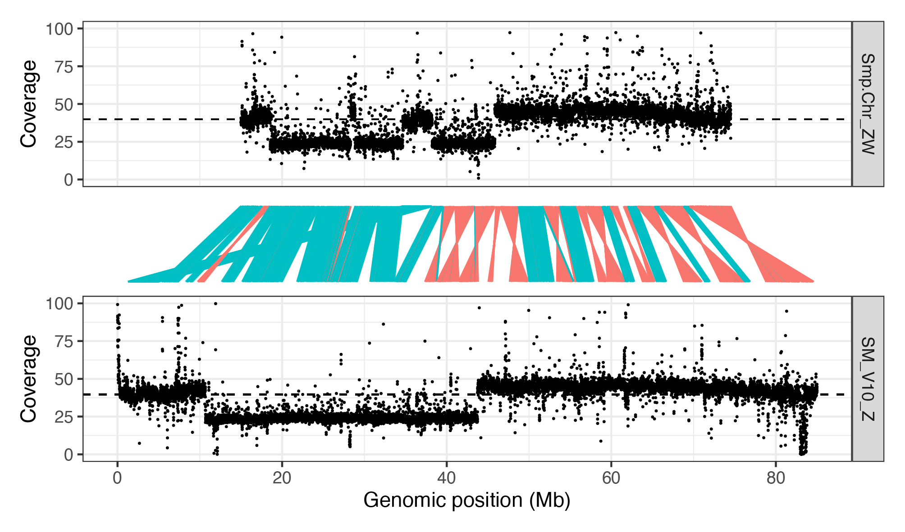

# Schistosoma mansoni V10 genome: V5 to V10 comparisons

### author: Stephen Doyle, stephen.doyle[at]sanger.ac.uk


```bash
# working directory
cd /nfs/users/nfs_s/sd21/lustre118_link/schistosoma_mansoni/V10/V5_vs_V10

```

## Direct comparison between V5 genes mapped to V10
- use liftoff to transfer V5 annotations to V10 genome
- use gffcompare to identify overlapping annotations between the V5-to-V10-genome annotations and the current V10 annotations

### Generate the data
```bash
cd /nfs/users/nfs_s/sd21/lustre118_link/schistosoma_mansoni/V10/V5_vs_V10/LIFTOFF

# clean up the V5 and V10 annotations for comparison
cat ../schistosoma_mansoni.PRJEA36577.WBPS1.annotations.gff3 | awk -F '[\t;]' '{print $1,$2,$3,$4,$5,$6,$7,$8,$9";"$10}' OFS="\t" | grep -v "#" > V5.clean_annotation.gff3

cat ../../REF/SM_V10.annotation.preWBP18checked.gff3 | awk -F '[\t;]' '{print $1,$2,$3,$4,$5,$6,$7,$8,$9";"$10";"$11}' OFS="\t" | grep -v "#" > V10.clean_annotation.gff3

# load and run liftoff
conda activate liftoff

bsub.py 10 liftoff_v5_v10 "liftoff -g V5.clean_annotation.gff3 -o V5_to_V10.liftoff.gff3 ../../REF/SM_V10.genome.preWBP18checked.fa ../schistosoma_mansoni.PRJEA36577.WBPS1.genomic.fa"

conda deactivate 

# run gff compare between V5 transferred and V10 annotations
gffcompare -r V10.clean_annotation.gff3 V5_to_V10.liftoff.gff3

#>  10960 reference transcripts loaded.
#>  66 duplicate reference transcripts discarded.
#>  11713 query transfrags loaded.

```
- generated a "gffcmp.loci" file, with the output of the comparison, showing which genes are overlapping. It is not quantitative, so will need to do some stats later.

### Calculation of shared and unique genes
Want to determine:
- features not transferred by liftoff - putatively deleted
- features transferred but with no overlapping V10 annotation - putatively deleted
- genes with the same location and same gene ID
- genes with the same location and with a different ID
- genes that have been split in V10
- genes that have been merged in V10


```
# V5 transcripts not transferred to V10 by liftoff
wc -l unmapped_features.txt
#> 112 unmapped_features.txt

# V5 transcripts present in V10 genome, but no V10 annotation - must be deleted
awk '{if($3=="-") print}' gffcmp.loci | wc -l
#> 982 


# comparison of gene IDs
awk -F '[\t ,]' '{if($3!="-") print NF, $0 }' gffcmp.loci | sort | uniq -c | sed -e 's/\.[123456789]//g' -e 's/transcript://g'  | cut -f3,4 | while read V10 V5; do
     # V10 gene ID
     V10_gene=$( echo ${V10} | sed -e 's/,/\n/g' -e 's/|/\n/g' | sed -n '0~2p' | sort | uniq )
     # V10 gene count
     V10_gene_n=$( echo ${V10} | sed -e 's/,/\n/g' -e 's/|/\n/g' | sed -n '0~2p' | sort | uniq | wc -l )
     # V5 gene ID
     V5_gene=$( echo ${V5} | sed 's/,/\n/g' | sort | uniq )
     # V5 gene count
     V5_gene_n=$( echo ${V5} | sed 's/,/\n/g' | sort | uniq | wc -l )
     
     # is the gene ID the same?
     if [[ ${V10_gene} == ${V5_gene} ]]; then
     echo -e "same_ID"",""V5"","${V5_gene}","${V5_gene_n}",""V10"","${V10_gene}","${V10_gene_n};
     
     # same gene, different id?
     elif [[ ${V10_gene_n} -eq "1" ]] && [[ ${V5_gene_n} -eq "1" ]] && [[ ${V10_gene} != ${V5_gene} ]]; then
     echo -e "diff_ID"",""V5"","${V5_gene}","${V5_gene_n}",""V10"","${V10_gene}","${V10_gene_n};
     elif [[ ${V10_gene_n} -eq ${V5_gene_n} ]] && [[ ${V10_gene} != ${V5_gene} ]]; then
     echo -e "diff_ID_complex"",""V5"","${V5_gene}","${V5_gene_n}",""V10"","${V10_gene}","${V10_gene_n};

     # split in v10?
     elif [ ${V10_gene_n} -gt ${V5_gene_n} ] && [[ ${V5_gene_n} -eq "1" ]]; then
     echo -e "split_in_V10_simple"",""V5"","${V5_gene}","${V5_gene_n}",""V10"","${V10_gene}","${V10_gene_n};
     elif [ ${V10_gene_n} -gt ${V5_gene_n} ] && [[ ${V5_gene_n} -gt "1" ]]; then
     echo -e "split_in_V10_complex"",""V5"","${V5_gene}","${V5_gene_n}",""V10"","${V10_gene}","${V10_gene_n};
     
     elif [ ${V10_gene_n} -lt ${V5_gene_n} ] && [[ ${V10_gene_n} -eq "1" ]]; then
     echo -e "merged_in_V10_simple"",""V5"","${V5_gene}","${V5_gene_n}",""V10"","${V10_gene}","${V10_gene_n};
     elif [ ${V10_gene_n} -lt ${V5_gene_n} ] && [[ ${V10_gene_n} -gt "1" ]]; then
     echo -e "merged_in_V10_complex"",""V5"","${V5_gene}","${V5_gene_n}",""V10"","${V10_gene}","${V10_gene_n};

     fi;
     done > V5_2_V10_same_split_merged.txt

cut -f1 -d "," V5_2_V10_same_split_merged.txt | sort | uniq -c
#>   1222 diff_ID
#>     22 merged_in_V10_complex
#>    967 merged_in_V10_simple
#>   6044 same_ID
#>      7 split_in_V10_complex
#>    188 split_in_V10_simple

wc -l V5_2_V10_same_split_merged.txt
#> 8450 V5_2_V10_same_split_merged.txt


# as the complex genes contain multiple V10 genes, can find the total genes represented in V5 and V10
cat V5_2_V10_same_split_merged.txt | datamash -t "," sum 4 sum 7
# countV5, countV10
#> 9735,8748

# this means there are (8748 - 8450 =) 298 additional genes in the dataset in V10, 

# genes in V10 with no evidence of a transferred gene - novel in V10
bedtools intersect -v -s -a V10.clean_annotation.gff3 -b V5_to_V10.liftoff.gff3 | awk '$3=="gene" {print}' | wc -l
#> 1147

bedtools intersect -v -s -a V10.clean_annotation.gff3 -b V5_to_V10.liftoff.gff3 | awk -F'[\t;]' '$3=="gene" {print "new_gene", $9, $1, $4,$5, $7}' OFS="\t" | sed 's/ID=//g' > V10.new-genes.txt

```

- Summary of genes 
1222	diff_ID	
22	merged_in_V10_complex	
967	merged_in_V10_simple	
6044	same_ID	
7	split_in_V10_complex	
188	split_in_V10_simple	
298	in complex gene models
1147	novel in V10	
- in total, 9895 V10 genes accounted for		


## Have gene structure changed?
- want to know to what degree genes have been improved
- gene splits and merges is one way, characterised above
- previous version of paper described it as >20% change at the amino acid level
- will characterise this for all genes with the same gene ID and for genes with different IDs but the same location, ie. where I can defined 1:1 relationships

```bash
cd /nfs/users/nfs_s/sd21/lustre118_link/schistosoma_mansoni/V10/V5_vs_V10/GENE_UPDATES

ln -s ../LIFTOFF/V5_2_V10_same_split_merged.txt


grep "same_ID\|diff_ID" V5_2_V10_same_split_merged.txt | grep -v "complex" | wc -l
#> 7220 genes in a 1:1 relationship between V5 and V10

grep "same_ID\|diff_ID" V5_2_V10_same_split_merged.txt | grep -v "complex" | awk -F '[,]' '{print $3,$6}' OFS="\t" > V5_V10_1-2-1.genes.txt


# 
gffread -y V10.proteins.fa -g ../../REF/SM_V10.genome.preWBP18checked.fa ../../REF/SM_V10.annotation.preWBP18checked.gff3

fastaq to_fasta -l0 V10.proteins.fa V10.proteins.l0.fa
sed -i 's/\.$//g' V10.proteins.l0.fa

gffread -y V5.proteins.fa -g ../schistosoma_mansoni.PRJEA36577.WBPS1.genomic.fa ../schistosoma_mansoni.PRJEA36577.WBPS1.annotations.gff3

fastaq to_fasta -l0 V5.proteins.fa V5.proteins.l0.fa
sed -i 's/\.$//g' V5.proteins.l0.fa


module load emboss/6.6.0--h6debe1e_0

echo -e V5_GENE"\t"V10_GENE"\t"LENGTH"\t"IDENTITY"\t"SIMILARITY"\t"GAPS"\t"SCORE > V5_V10_1-2-1.genes.needle-comparison.txt
while read V5_GENE V10_GENE; do
     grep -A1 -m1 "${V5_GENE}" V5.proteins.l0.fa > V5.gene.tmp.fa
     grep -A1 -m1 "${V10_GENE}" V10.proteins.l0.fa > V10.gene.tmp.fa
     needle -asequence V5.gene.tmp.fa -bsequence V10.gene.tmp.fa -gapopen 10 -gapextend 0.5 -outfile needle.out.tmp
     LENGTH=$(grep "Length" needle.out.tmp | awk '{print $3}')
     IDENTITY=$(grep "Identity" needle.out.tmp | awk -F '[()]' '{print $2}' | sed 's/%//g' )
     SIMILARITY=$(grep "Similarity" needle.out.tmp | awk -F '[()]' '{print $2}' | sed 's/%//g')
     GAPS=$(grep "Gaps" needle.out.tmp | awk -F '[()]' '{print $2}' | sed 's/%//g')
     SCORE=$(grep "Gaps" needle.out.tmp | awk -F '[()]' '{print $2}' | sed 's/%//g')
     echo -e ${V5_GENE}"\t"${V10_GENE}"\t"${LENGTH}"\t"${IDENTITY}"\t"${SIMILARITY}"\t"${GAPS}"\t"${SCORE} >> V5_V10_1-2-1.genes.needle-comparison.txt;
     done < V5_V10_1-2-1.genes.txt

```


## Checking for updates in transcripts
```bash
# shared gene ids
diff -y <(sort sm_v5.geneids.txt) <(sort sm_v10.geneids.txt) | grep -E "gene.*gene" | cut -f1 | sed 's/gene=//g' > sm_shared_genes.txt


# extract first transcript from V5 of shared genes
>sm_v5.spliced-exons.shared.fa

while read NAME; do
     grep -A1 -m1 "${NAME}" sm_v5.spliced-exons.l0.fa >> sm_v5.spliced-exons.shared.fa
done < sm_shared_genes.txt

# extract first transcript from V10 of shared genes
>sm_v10.spliced-exons.shared.fa

while read NAME; do
     grep -A1 -m1 "${NAME}" sm_v10.spliced-exons.l0.fa >> sm_v10.spliced-exons.shared.fa
done < sm_shared_genes.txt


makeblastdb -in sm_v5.spliced-exons.shared.fa -out  sm_v5.spliced-exons.shared -dbtype nucl

blastn -outfmt 6 -db sm_v5.spliced-exons.shared -query sm_v10.spliced-exons.shared.fa


>sm_v5.proteins.shared.fa

while read NAME; do
     grep -A1 -m1 "${NAME}" sm_v5.proteins.l0.fa >> sm_v5.proteins.shared.fa
done < sm_shared_genes.txt


>sm_v10.proteins.shared.fa

while read NAME; do
     grep -A1 -m1 "${NAME}" sm_v10.proteins.l0.fa >> sm_v10.proteins.shared.fa
done < sm_shared_genes.txt

# fix proteins files for diamond - remove stop codons "."
sed -i '/^>/!s/\.//g' sm_v5.proteins.shared.fa
sed -i '/^>/!s/\.//g' sm_v10.proteins.shared.fa


module load diamond/2.0.12

diamond makedb --in sm_v5.proteins.shared.fa --db sm_v5.proteins.shared

diamond blastp --db sm_v5.proteins.shared.dmnd --query sm_v10.proteins.shared.fa --outfmt "6 score" | sed 's/transcript://g' | awk '$1==$2 {print}' | more


>sm_v5.proteins.n1.fa

while read NAME; do
     grep -A1 -m1 "${NAME}" sm_v5.proteins.l0.fa >> sm_v5.proteins.n1.fa
done < sm_v5.proteins.ids.txt

>sm_v10.proteins.n1.fa

while read NAME; do
     grep -A1 -m1 "${NAME}" sm_v10.proteins.l0.fa >> sm_v10.proteins.n1.fa
done < sm_v10.proteins.ids.txt

sed -i '/^>/!s/\.//g' sm_v5.proteins.n1.fa
sed -i '/^>/!s/\.//g' sm_v10.proteins.n1.fa

diamond makedb --in sm_v5.proteins.n1.fa --db sm_v5.proteins.n1

diamond blastp --db sm_v5.proteins.n1.dmnd --query sm_v10.proteins.n1.fa --outfmt "6" | sed 's/transcript://g' | awk '$1==$2 {print}' | more


## Z chromosome - comparison between V5 ZW and V10 Z
### Promer to show synteny between V5 VZ and V10 Z
```bash
cd /nfs/users/nfs_s/sd21/lustre118_link/schistosoma_mansoni/V10/V5_vs_V10/Z_CHROMOSOME

# get V5 ZW chromosome
samtools faidx ../schistosoma_mansoni.PRJEA36577.WBPS1.genomic.fa Smp.Chr_ZW > SM_V5_ZW.fa

# get V10 Z chromosome
samtools faidx ../../REF/SM_V10.genome.preWBP18checked.fa SM_V10_Z > SM_V10_Z.fa

# use promer to compare
bsub.py 20 Z_promer "promer -p Z_V5_v_V10_promer --coords --mum SM_V10_Z.fa SM_V5_ZW.fa"

bsub.py 20 Z_nucmer "nucmer -p Z_V5_v_V10_nucmer --mum SM_V10_Z.fa SM_V5_ZW.fa"
```


### Coverage of Z in V5 and V10 

```bash 
cd /nfs/users/nfs_s/sd21/lustre118_link/schistosoma_mansoni/V10/V5_vs_V10/Z_CHROMOSOME/COVERAGE

mkdir DATA
cd DATA
ln -s /lustre/scratch118/infgen/team133/alt/SCHISTO/pathfind_6520_5/6520_5_1.fastq.gz
ln -s /lustre/scratch118/infgen/team133/alt/SCHISTO/pathfind_6520_5/6520_5_2.fastq.gz

cd ../

# run mapping script 


ln -s /nfs/users/nfs_s/sd21/lustre118_link/schistosoma_mansoni/V10/V5_vs_V10/schistosoma_mansoni.PRJEA36577.WBPS1.genomic.fa SM_V5.fa
ln -s /nfs/users/nfs_s/sd21/lustre118_link/schistosoma_mansoni/V10/REF/SM_V10.genome.preWBP18checked.fa SM_V10.fa


samtools faidx SM_V5.fa
samtools faidx SM_V10.fa

cut -f1,2 SM_V5.fa.fai > SM_V5.genome
cut -f1,2 SM_V10.fa.fai > SM_V10.genome

bedtools makewindows -g SM_V5.genome -w 5000 > SM_V5.5000bp.bed
bedtools makewindows -g SM_V10.genome -w 5000 > SM_V10.5000bp.bed

grep "Smp.Chr_ZW" SM_V5.5000bp.bed | grep -v "unplaced" > SM_V5.5000bp.ZW.bed
grep "SM_V10_Z" SM_V10.5000bp.bed > SM_V10.5000bp.Z.bed

# calculate genome coverage in 500 bp windows
samtools bedcov SM_V5.5000bp.ZW.bed /nfs/users/nfs_s/sd21/lustre118_link/schistosoma_mansoni/V10/V5_vs_V10/Z_CHROMOSOME/COVERAGE/SM_V5_MAPPING/6520_5_mapping/6520_5.deduped.bam > SM_V5.5000bp.ZW.coverage &

samtools bedcov SM_V10.5000bp.Z.bed /nfs/users/nfs_s/sd21/lustre118_link/schistosoma_mansoni/V10/V5_vs_V10/Z_CHROMOSOME/COVERAGE/SM_V10_MAPPING/6520_5_mapping/6520_5.deduped.bam > SM_V10.5000b.Z.coverage &

```

```R
library(tidyverse)
library(patchwork)


cov_V5 <- read.table("SM_V5.5000bp.ZW.coverage", header=F)
cov_V5$cov_median <- median(cov_V5$V4/500)
cov_V5$genome <- "V5"
cov_V5 <- mutate(cov_V5, id = row_number())


cov_V10 <- read.table("SM_V10.5000b.Z.coverage", header=F)
cov_V10$cov_median <- median(cov_V10$V4/500)
cov_V10$genome <- "V10"
cov_V10 <- mutate(cov_V10, id = row_number())


cov_V5_median <- median(cov_V5$V4/5000)
plot_cov_v5 <- ggplot(cov_V5) +
     geom_point(aes((V2+15e6)/1e6, V4/5000), size=0.1) +
     theme_bw() +
     labs(x="Genomic position (bp)", y="Coverage")  +
     ylim(0,100) + xlim(0,85e6/1e6) +
     geom_hline(yintercept=cov_V5_median, linetype="dashed") +
     theme(axis.title.x=element_blank(),
        axis.text.x=element_blank(),
        axis.ticks.x=element_blank()) +
     facet_grid(V1~.)

cov_V10_median <- median(cov_V10$V4/5000)
plot_cov_v10 <- ggplot(cov_V10) +
     geom_point(aes(V2/1e6, V4/5000), size=0.1) +
     theme_bw() +
     labs(x="Genomic position (Mb)", y="Coverage")  +
     ylim(0,100) + xlim(0,85e6/1e6) +
     geom_hline(yintercept=cov_V10_median, linetype="dashed") +
     facet_grid(V1~.)


nucmer_data <- read.table("../Z_V5_v_V10_nucmer.I98-L10k.coords")

nucmer_data <- nucmer_data %>% mutate(direction = ifelse((V2 > V1) & (V4 > V3), "syntenic", "rearranged"))

# plot
nucmer_plot <- ggplot(nucmer_data) + 
     geom_segment(aes(x=V1/1e6, y=0, xend=(V3+15e6)/1e6, yend=1, colour=direction, alpha=V7/100)) + 
     theme_void() + 
     xlim(0,85e6/1e6) +
     guides(alpha ="none", colour="none")

# note - the addition of the +15e6 on V3 shifts the position of the plot to line up in the middle

# PLOT
plot_cov_v5 + nucmer_plot + plot_cov_v10 + plot_layout(ncol=1, heights =c(2, 1, 2) )

ggsave("figure_V5vV10_zchromosome_coverage_synteny.pdf", height=100, width=170, units="mm")
ggsave("figure_V5vV10_zchromosome_coverage_synteny.png")

```
