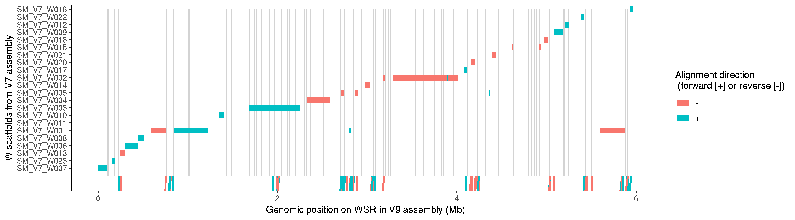

# Schistosoma mansoni V10 genome: W specific repeat analysis

### author: Stephen Doyle, stephen.doyle[at]sanger.ac.uk


## W-specific repeat position in WSR
### Using nucmer to find position of the repeats in the genome
```bash
cd /nfs/users/nfs_s/sd21/lustre118_link/schistosoma_mansoni/V10/REPEATS/WSR

bsub.py 10 nucmer "nucmer --prefix combined_repeats_SD22022_to_v10 --maxmatch SM_V10_WSR.fa combined_repeats_SD220223.fasta"

show-coords -lTHc -I 80 combined_repeats_SD22022_to_v10.delta > combined_repeats_SD22022_to_v10.coords

grep "WSR" combined_repeats_SD22022_to_v10.coords > combined_repeats_SD22022_to_v10.WSR.coords

```

## Similarity between W-specific repeat groups
```bash
cd /nfs/users/nfs_s/sd21/lustre118_link/schistosoma_mansoni/V10/REPEATS/WSR

samtools faidx ../REF/SM_V10.genome.preWBP18checked.fa SM_V10_WSR > SM_V10_WSR.fa

samtools faidx SM_V10_WSR.fa

cut -f1,2 SM_V10_WSR.fa.fai > SM_V10_WSR.genome

bedtools makewindows -g SM_V10_WSR.genome -w 10000 > SM_V10_WSR.10k.bed

bedtools getfasta -fi SM_V10_WSR.fa -fo SM_V10_WSR.10k.fa -bed SM_V10_WSR.10k.bed

module load mash/2.1.1--he518ae8_0

bsub.py 10 mash_dist "mash dist SM_V10_WSR.10k.fa SM_V10_WSR.10k.fa"

grep "^SM_V10" mash_dist.o > mash_dist.txt

cat mash_dist.txt | awk '{sub(/-/, "\t", $2)}2' | awk '{sub(/:/, "\t", $2)}2' | awk '{sub(/-/, "\t", $1)}1' | awk '{sub(/:/, "\t", $1)}1' OFS="\t" > mash_dist_coords.txt

```


### plot of WSR repeats
```R  
# load libraries
library(tidyverse)
library(RColorBrewer)
library(patchwork)
library(viridis)

data1 <- read.table("combined_repeats_SD22022_to_v10.WSR.coords", header=F)

# set colours
n <- 39
qual_col_pals = brewer.pal.info[brewer.pal.info$category == 'qual',]
col_vector = unlist(mapply(brewer.pal, qual_col_pals$maxcolors, rownames(qual_col_pals)))

plot1 <- ggplot(data1, aes(V1,fill=V13)) +
     geom_histogram(binwidth=10000) +
     theme_bw() +
     scale_fill_manual(values=col_vector) +
     labs(title="A", fill="Repeat ID", y="Repeat count", x="") +
     theme(legend.key.size = unit(0.3, 'cm')) +
     theme(axis.text.x=element_blank(),
      axis.ticks.x=element_blank())
     


data2 <- read.table("mash_dist_coords.txt")

plot2 <- ggplot(data2, aes(V3/1e6, V6/1e6, fill=V7)) + 
    geom_tile() + 
    scale_fill_viridis(direction = 1) +
    labs(title="B", x="WSR position (Mb)", y="WSR position (Mb)", fill="Similarity\n(mash distance)") +
    theme_bw() 

plot1 + plot2 + plot_layout(ncol=1, heights = c(1, 2)) 

ggsave("WSR_repeats.pdf", width=7, height=8)

```


### Mapping the W7 contigs to the new genome assembly
- want to see how the contigs from the previous version fits with the current assembly
- basically show the assembly path

```bash
cd /nfs/users/nfs_s/sd21/lustre118_link/schistosoma_mansoni/ALT_CONTIGS

# map V7 contigs to V9
minimap2 -Y --secondary=no -x asm20 SM_V9_21Feb.fa SM_V7_Wcontigs.fa -o V7w_to_V9_minimap_v2.paf    

# collate coordinates for mapping
grep "SM_V9_WSR" V7w_to_V9_minimap_v2.paf | sort -k8n | cut -f1-11 > V7w_to_V9_minimap_v2.txt

# extract coordinates of gaps within the assembly, to show where joins have been made that are typically padded with 100 Ns
samtools faidx SM_V9_21Feb.fa SM_V9_WSR > SM_V9_WSR.fa

# Alan wrote a tool ages ago to make a bed file of gaps
python /nfs/users/nfs_a/alt/python/bin/fasta_gaps_to_bed.py SM_V9_WSR.fa > SM_V9_WSR.gaps.bed

```

### Mapping pacbio reads from the junctions joining W contigs from v7
```bash
cd /nfs/users/nfs_s/sd21/lustre118_link/schistosoma_mansoni/WSR_construction

# using a file called "# junction_subreads.list" provided by Alan containing the reads spanning the junctions , ie.

# m160825_183217_00127_c101019712550000001823228410211634_s1_p0/123055/6155_12379
# m160825_183217_00127_c101019712550000001823228410211634_s1_p0/123055/6155_12379

# use the list of pacbio read names to pull out the reads from the fasta file containing all Schisto pacbio reads
while read NAME; do
     samtools faidx pb_reads.fasta $NAME;
done < junction_subreads.list > junction_subreads.v2.fasta

# map the junction pacbio reads back to the genome
minimap2 -Y --secondary=no -x map-pb SM_V9_21Feb.fa junction_subreads.v2.fasta > junction_subreads.v2.paf

# sort and collect those that map to W
cat junction_subreads.v2.paf | grep "SM_V9_WSR" > junction_subreads.v2.WSR.paf


cd ../ALT_CONTIGS

ln -s ../WSR_construction/junction_subreads.v2.WSR.paf
```


### bring it all together
```R
library(tidyverse)

data <- read.table("V7w_to_V9_minimap_v2.txt", header=F)
data <- data %>% group_by(V1) %>% mutate(group_id = min(V8))
data <- data %>% arrange(V1,group_id)

gaps <- read.table("SM_V9_WSR.gaps.bed", header=F)

reads <- read.table("junction_subreads.v2.WSR.paf", header=F, sep="\t")
reads <- reads %>% group_by(V1) %>% mutate(group_id = min(V8))

plot_V7W <- ggplot() +
     geom_segment(data=data, aes(x=V8/1e6, xend=V9/1e6, y=reorder(V1,(group_id)), yend=reorder(V1,(group_id)), col=as.factor(V5)), size=3) +
     geom_segment(data=gaps, aes(x=V2/1e6, xend=V3/1e6, y=0, yend=22), col="lightgrey") +
     geom_segment(data=reads, aes(x=V8/1e6, xend=V9/1e6, y=-2, yend=0, col=as.factor(V5), group="Pacbio reads"), size=1) +
     geom_segment(data=data, aes(x=V8/1e6, xend=V9/1e6, y=reorder(V1,(group_id)), yend=reorder(V1,(group_id)), col=as.factor(V5)), size=3) +
     labs(x="Genomic position on WSR in V9 assembly (Mb)", y="W scaffolds from V7 assembly", col="Alignment direction\n (forward [+] or reverse [-])") +
     theme_classic()
plot_V7W

ggsave("WSR_construction_V7_to_V9.png")
ggsave("WSR_construction_V7_to_V9.pdf", width=14, height=4)

```



## Using the repeat coordinates to calculate the repeat coverage
```bash
# bedtools to calculate coverage in repeats
bedtools multicov -bams 6520_5_1_sorted.bam -bed combined_repeats_SD220223.bed > combined_repeats_SD220223.coverage

# multiply the number of reads by read length, and divide by length of array
cat combined_repeats_SD220223.coverage | awk '{print $5*100/($3-$2)}'

```