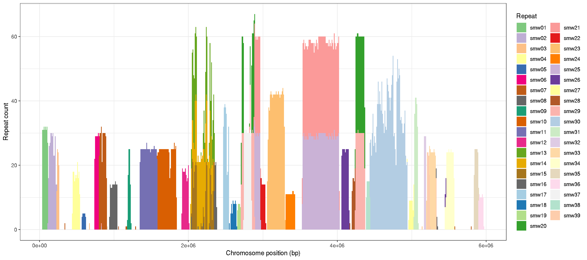

# W specific repeat analysis

### author: Stephen Doyle, stephen.doyle[at]sanger.ac.uk


## Using nucmer to find position of the repeats in the genome
```bash
nucmer --prefix combined_repeats_SD22022_to_v9 --maxmatch sm_v9.fa combined_repeats_SD220223.fasta

show-coords -lTHc -I 80 combined_repeats_SD22022_to_v9.delta > combined_repeats_SD22022_to_v9.coords

grep "WSR" combined_repeats_SD22022_to_v9.coords > combined_repeats_SD22022_to_v9.WSR.coords
```

## Using the repeat coordinates to calculate the repeat coverage
```bash
# bedtools to calculate coverage in repeats
bedtools multicov -bams 6520_5_1_sorted.bam -bed combined_repeats_SD220223.bed > combined_repeats_SD220223.coverage

# multiply the number of reads by read length, and divide by length of array
cat combined_repeats_SD220223.coverage | awk '{print $5*100/($3-$2)}'

```


# plot of WSR repeats
```R  
library(tidyverse)
library(RColorBrewer)

data <- read.table("combined_repeats_SD22022_to_v9.WSR.coords", header=F)

# set colours
n <- 39
qual_col_pals = brewer.pal.info[brewer.pal.info$category == 'qual',]
col_vector = unlist(mapply(brewer.pal, qual_col_pals$maxcolors, rownames(qual_col_pals)))

ggplot(data, aes(V1,fill=V13)) +
     geom_histogram(binwidth=10000) +
     theme_bw() +
     scale_fill_manual(values=col_vector) +
     labs(fill="Repeat", x="Chromosome position (bp)", y="Repeat count")

ggsave("WSR_repeats.pdf", width=7, height=5)
ggsave("WSR_repeats.png")
```


- plot shows repeat density per 10kb window, coloured by repeat type


## Normalising coverage to estimate copy number of gene family arrays: IPSE and OMEGA

### IPSE
```bash

# ISPE coverage using samtools
cat mb_IPSE.gff | awk '{print $1,$4,$5,$9}' OFS="\t" > mb_IPSE.bed

samtools bedcov mb_IPSE.bed 6520_5_1_sorted.bam > mb_IPSE.coverage2

cat mb_IPSE.coverage2 | awk '{print $1,$2,$3,$4,$5/($3-$2)}' OFS="\t" | datamash median 5
#>53.7555

53.7555/44.6 = 1.21x higher coverage in region

16 * 1.21 = 20 likely copies of IPSE based on normalising coverage
```

### OMEGA
```
# OMEGA coverage using samtools
cat mb_omega.gff | awk '{print $1,$4,$5,$9}' OFS="\t" > mb_omega.bed

samtools bedcov mb_omega.bed 6520_5_1_sorted.bam > mb_omega.coverage

cat mb_omega.coverage | awk '{print $1,$2,$3,$4,$5/($3-$2)}' OFS="\t" | datamash median 5

#> 78.35955/44.6 = 1.76x higher coverage in region

#> 5 copies * 1.76x = 8.8 likely copies of omega based on normalising coverage
#--- note - there are 7 copies of omega in this region, but only 5 are in a high coverage area. Two copies are not. See Supplementary Figure 1C
#--- therefore: 8.8 normalised copies + 2 addition copies =  10.8 copies, ~11 copies reported in the paper.

```


```R

library(tidyverse)
library(patchwork)

data <- read.table("V7W_vs_V9_mum.filtered.coords", header=F)
rep_data <- read.table("W_repeat_data.txt", header=T, sep="\t")
genes_data <- read.table("../WSR_genes.bed", header=F)


# dotplot
ggplot(data) + geom_segment(aes(x=V1, y=V1+V3, xend=V2, yend=V1+V4, col=V11), size=1) + theme_bw() + labs(x="SM_V9_WSR", y="W scaffolds from V7", col="W scaffolds from V7")


data2 <- data %>% group_by(V11) %>% mutate(group_id = median(V1))
rep_data2 <- rep_data %>% group_by(Repeat.name) %>% mutate(group_id = median(V1))

plot_v7w <- ggplot(data2) +
     geom_segment(aes(x=V1, xend=V2, y=as.factor(group_id), yend=as.factor(group_id), col=V11), size=3) +
     theme_bw() + theme(legend.position="none", axis.text.y = element_blank()) +
     labs(title="V7 W scaffolds", y="", x="Genomic position on V9 W scaffold (bp)")

plot_rep <- ggplot(rep_data2) +
     geom_segment(aes(x=START, xend=END, y=reorder(group_id,START), yend=reorder(group_id,START), col=Repeat.name), size=3) +
     theme_bw() + theme(legend.position="none", axis.text.y = element_blank()) +
     labs(title="Repeats", y="", x="Genomic position on V9 W scaffold (bp)")

plot_genes <- ggplot(genes_data) +
     geom_segment(aes(x=V2, xend=V3, y=V4, yend=V4, col=V5), size=3) +
     theme_bw() + theme(legend.position="none") +
     labs(title="V9 W genes", y="Strand", x="Genomic position on V9 W scaffold (bp)")

plot_v7w + plot_rep + plot_genes + plot_layout(ncol=1)


```


### Mapping the W7 contigs to the new genome assembly
- want to see how the contigs from the previous version fits with the current assembly
- basically show the assembly path

```bash
cd /nfs/users/nfs_s/sd21/lustre118_link/schistosoma_mansoni/ALT_CONTIGS

# map V7 contigs to V9
minimap2 -Y --secondary=no -x asm20 SM_V9_21Feb.fa SM_V7_Wcontigs.fa -o V7w_to_V9_minimap_v2.paf    

# collate coordinates for mapping
grep "SM_V9_WSR" V7w_to_V9_minimap_v2.paf | sort -k8n | cut -f1-11 > V7w_to_V9_minimap_v2.txt

# extract coordinates of gaps within the assembly, to show where joins have been made that are typically padded with 100 Ns
samtools faidx SM_V9_21Feb.fa SM_V9_WSR > SM_V9_WSR.fa

# Alan wrote a tool ages ago to make a bed file of gaps
python /nfs/users/nfs_a/alt/python/bin/fasta_gaps_to_bed.py SM_V9_WSR.fa > SM_V9_WSR.gaps.bed

```

### Mapping pacbio reads from the junctions joining W contigs from v7
```bash
cd /nfs/users/nfs_s/sd21/lustre118_link/schistosoma_mansoni/WSR_construction

# using a file called "# junction_subreads.list" provided by Alan containing the reads spanning the junctions , ie.

# m160825_183217_00127_c101019712550000001823228410211634_s1_p0/123055/6155_12379
# m160825_183217_00127_c101019712550000001823228410211634_s1_p0/123055/6155_12379

# use the list of pacbio read names to pull out the reads from the fasta file containing all Schisto pacbio reads
while read NAME; do
     samtools faidx pb_reads.fasta $NAME;
done < junction_subreads.list > junction_subreads.v2.fasta

# map the junction pacbio reads back to the genome
minimap2 -Y --secondary=no -x map-pb SM_V9_21Feb.fa junction_subreads.v2.fasta > junction_subreads.v2.paf

# sort and collect those that map to W
cat junction_subreads.v2.paf | grep "SM_V9_WSR" > junction_subreads.v2.WSR.paf


cd ../ALT_CONTIGS

ln -s ../WSR_construction/junction_subreads.v2.WSR.paf
```


### bring it all together
```R
library(tidyverse)

data <- read.table("V7w_to_V9_minimap_v2.txt", header=F)
data <- data %>% group_by(V1) %>% mutate(group_id = min(V8))
data <- data %>% arrange(V1,group_id)

gaps <- read.table("SM_V9_WSR.gaps.bed", header=F)

reads <- read.table("junction_subreads.v2.WSR.paf", header=F, sep="\t")
reads <- reads %>% group_by(V1) %>% mutate(group_id = min(V8))

plot_V7W <- ggplot() +
     geom_segment(data=data, aes(x=V8/1e6, xend=V9/1e6, y=reorder(V1,(group_id)), yend=reorder(V1,(group_id)), col=as.factor(V5)), size=3) +
     geom_segment(data=gaps, aes(x=V2/1e6, xend=V3/1e6, y=0, yend=22), col="lightgrey") +
     geom_segment(data=reads, aes(x=V8/1e6, xend=V9/1e6, y=-2, yend=0, col=as.factor(V5), group="Pacbio reads"), size=1) +
     geom_segment(data=data, aes(x=V8/1e6, xend=V9/1e6, y=reorder(V1,(group_id)), yend=reorder(V1,(group_id)), col=as.factor(V5)), size=3) +
     labs(x="Genomic position on WSR in V9 assembly (Mb)", y="W scaffolds from V7 assembly", col="Alignment direction\n (forward [+] or reverse [-])") +
     theme_classic()
plot_V7W

ggsave("WSR_construction_V7_to_V9.png")
ggsave("WSR_construction_V7_to_V9.pdf", width=14, height=4)

```

