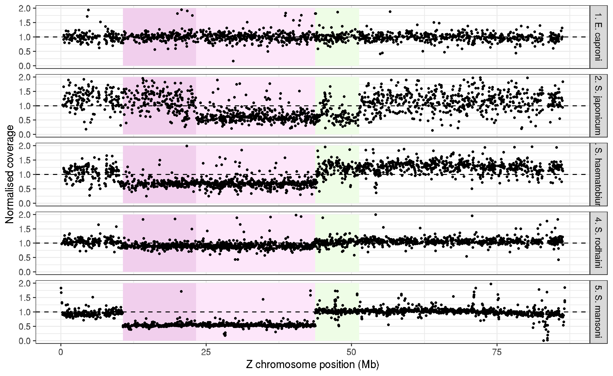

# Schistosoma mansoni V10 genome: Z chromosome strata

### author: Stephen Doyle, stephen.doyle[at]sanger.ac.uk


```bash
cd /nfs/users/nfs_s/sd21/lustre118_link/schistosoma_mansoni/V10/STRATA


/lustre/scratch118/infgen/team133/alt/SCHISTO/WZ_evolution/ecap/ecap_zw_orth.cov
/lustre/scratch118/infgen/team133/alt/SCHISTO/WZ_evolution/shaem/shaem_orth.cov
/lustre/scratch118/infgen/team133/alt/SCHISTO/WZ_evolution/Srod/srod_zw_orth2.cov
/lustre/scratch118/infgen/team133/alt/SCHISTO/WZ_evolution/sjap_orth.cov

cat SM_V10.annotation.preWBP18checked.gff3 | awk -F '[\t;]' '{if($3=="gene") print $1, $4, $5 , $9}' OFS="\t" | sed 's/ID=//g' > V10.genes.bed

ln -s /nfs/users/nfs_s/sd21/lustre118_link/schistosoma_mansoni/V10/V5_vs_V10/Z_CHROMOSOME/COVERAGE/SM_V10_MAPPING/6520_5_mapping/6520_5.deduped.bam
samtools index 6520_5.deduped.bam

bedtools multicov -bams 6520_5.deduped.bam -bed V10.genes.bed  > sm_v10_genes.cov
```

```R 
library(tidyverse)

V10_genes <- read.table("V10.genes.bed")
colnames(V10_genes) <- c("CHROMOSOME", "START", "STOP", "GENE_ID")

ecap_cov <- read.table("/lustre/scratch118/infgen/team133/alt/SCHISTO/WZ_evolution/ecap/ecap_zw_orth.cov")
colnames(ecap_cov) <- c("GENE_ID", "COUNT_1", "COUNT_2")
ecap_cov$SPECIES <- "1. E. caproni"
ecap_cov <- ecap_cov %>% select(GENE_ID, SPECIES, COUNT_1) %>% mutate(NORM = COUNT_1/median(COUNT_1))

shaem_cov <- read.table("/lustre/scratch118/infgen/team133/alt/SCHISTO/WZ_evolution/shaem/shaem_orth.cov")
colnames(shaem_cov) <- c("GENE_ID", "COUNT_1", "COUNT_2")
shaem_cov$SPECIES <- "3. S. haematobium"
shaem_cov <- shaem_cov %>% select(GENE_ID, SPECIES, COUNT_1) %>% mutate(NORM = COUNT_1/median(COUNT_1))

srod_cov <- read.table("/lustre/scratch118/infgen/team133/alt/SCHISTO/WZ_evolution/Srod/srod_zw_orth2.cov")
colnames(srod_cov) <- c("GENE_ID", "COUNT_1", "COUNT_2")
srod_cov$SPECIES <- "4. S. rodhaini"
srod_cov <- srod_cov %>% select(GENE_ID, SPECIES, COUNT_1) %>% mutate(NORM = COUNT_1/median(COUNT_1))

sjap_cov <- read.table("/lustre/scratch118/infgen/team133/alt/SCHISTO/WZ_evolution/sjap_orth.cov")
colnames(sjap_cov) <- c("GENE_ID", "COUNT_1", "COUNT_2")
sjap_cov$SPECIES <- "2. S. japonicum"
sjap_cov <- sjap_cov %>% select(GENE_ID, SPECIES, COUNT_1) %>% mutate(NORM = COUNT_1/median(COUNT_1))

sman_cov <- read.table("sm_v10_genes.cov")
sman_cov <- sman_cov %>% mutate(COUNT_1 = V5/(V3-V2))
colnames(sman_cov) <- c("CHROMOSOME", "START", "STOP", "GENE_ID", "RAW", "COUNT_1")
sman_cov$SPECIES <- "5. S. mansoni"
sman_cov <- sman_cov %>% select(GENE_ID, SPECIES, COUNT_1) %>% mutate(NORM = COUNT_1/median(COUNT_1))


cov_data <- union(ecap_cov, shaem_cov)
cov_data <- union(cov_data, srod_cov)
cov_data <- union(cov_data, sjap_cov)
cov_data <- union(cov_data, sman_cov)

data <- inner_join(V10_genes, cov_data, by="GENE_ID")
data <- data %>% filter(CHROMOSOME=="SM_V10_Z")

ggplot(data) + 
    geom_rect(xmin=10680112/1e6, xmax=23250000/1e6, ymin=0, ymax=2, fill="#F1CFED") +
    geom_rect(xmin=23250000/1e6, xmax=43743322/1e6, ymin=0, ymax=2, fill="#FDE6FA") +
    geom_rect(xmin=43743322/1e6, xmax=51300000/1e6, ymin=0, ymax=2, fill="#EEFDE6") +
    geom_point(aes(START/1e6,NORM), size=0.5) + 
    facet_grid(SPECIES~.) + 
    ylim(0,2) + 
    geom_hline(yintercept=1, linetype="dashed") + 
    theme_bw() +
    labs(y="Normalised coverage", x="Z chromosome position (Mb)")

ggsave("figure_Zchromosome_strata.pdf", height=4.5, width=5.5, units="in")
ggsave("figure_Zchromosome_strata.png")
```
